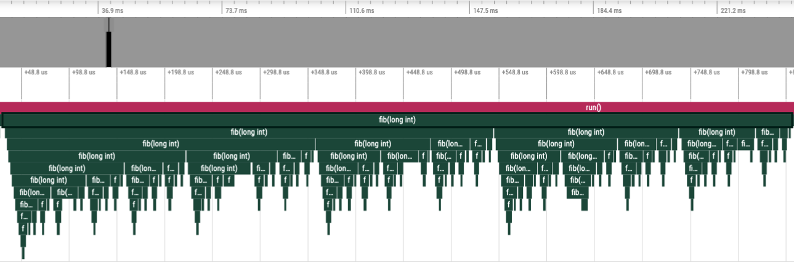
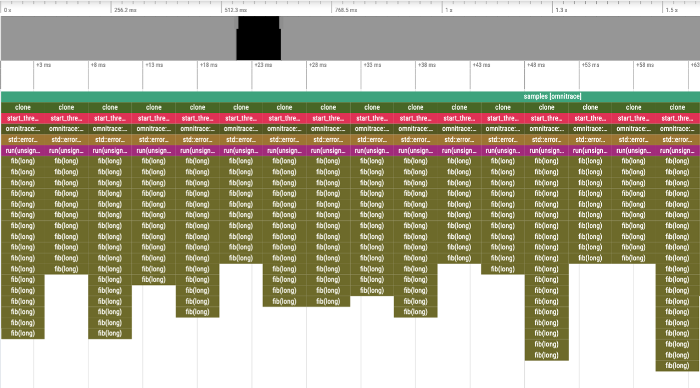

.. meta::
   :description: Omnitrace documentation and reference
   :keywords: Omnitrace, ROCm, profiler, tracking, visualization, tool, Instinct, accelerator, AMD

**********************
Data collection modes
**********************

Omnitrace supports several modes of recording trace and profiling data for your application.

.. note::
    
   For an explanation of the terms used in this topic, see 
   the :doc:`Omnitrace glossary <../reference/omnitrace-glossary>`.

+-----------------------------+---------------------------------------------------------+
| Mode                        | Description                                             |
+=============================+=========================================================+
| Binary Instrumentation      | Locates functions (and loops, if desired) in the binary |
|                             | and inserts snippets at the entry and exit              |
+-----------------------------+---------------------------------------------------------+
| Statistical Sampling        | Periodically pauses application at specified intervals  |
|                             | and records various metrics for the given call stack    |
+-----------------------------+---------------------------------------------------------+
| Callback APIs               | Parallelism frameworks such as ROCm, OpenMP, and Kokkos |
|                             | make callbacks into Omnitrace to provide information    |
|                             | about the work the API is performing                    |
+-----------------------------+---------------------------------------------------------+
| Dynamic Symbol Interception | Wrap function symbols defined in a position independent |
|                             | dynamic library/executable, like ``pthread_mutex_lock`` |
|                             | in ``libpthread.so`` or ``MPI_Init`` in the MPI library |
+-----------------------------+---------------------------------------------------------+
| User API                    | User-defined regions and controls for Omnitrace         |
+-----------------------------+---------------------------------------------------------+

The two most generic and important modes are binary instrumentation and statistical sampling. 
It is important to understand their advantages and disadvantages.
Binary instrumentation and statistical sampling can be performed with the ``omnitrace-instrument`` 
executable. For statistical sampling, it's highly recommended to use the
``omnitrace-sample`` executable instead if binary instrumentation isn't required or needed. 
Callback APIs and dynamic symbol interception can be utilized with either tool.

Binary instrumentation
-----------------------------------

Binary instrumentation lets you record deterministic measurements for 
every single invocation of a given function.
Binary instrumentation effectively adds instructions to the target application to 
collect the required information. It therefore has the potential to cause performance 
changes which might, in some cases, lead to inaccurate results. The effect depends on 
the information being collected and which features are activated in Omnitrace. 
For example, collecting only the wall-clock timing data
has less of an effect than collecting the wall-clock timing, CPU-clock timing, 
memory usage, cache-misses, and number of instructions that were run. Similarly, 
collecting a flat profile has less overhead than a hierarchical profile 
and collecting a trace OR a profile has less overhead than collecting a 
trace AND a profile.

In Omnitrace, the primary heuristic for controlling the overhead with binary 
instrumentation is the minimum number of instructions for selecting functions 
for instrumentation.

Statistical sampling
-----------------------------------

Statistical call-stack sampling periodically interrupts the application at 
regular intervals using operating system interrupts.
Sampling is typically less numerically accurate and specific, but the 
target program runs at nearly full speed.
In contrast to the data derived from binary instrumentation, the resulting 
data is not exact but is instead a statistical approximation.
However, sampling often provides a more accurate picture of the application 
execution because it is less intrusive to the target application and has fewer
side effects on memory caches or instruction decoding pipelines. Furthermore, 
because sampling does not affect the execution speed as much, is it
relatively immune to over-evaluating the cost of small, frequently called 
functions or "tight" loops.

In Omnitrace, the overhead for statistical sampling depends on the 
sampling rate and whether the samples are taken with respect to the CPU time 
and/or real time.

Binary instrumentation vs. statistical sampling example
-------------------------------------------------------

Consider the following code:

.. code-block:: c++

   long fib(long n)
   {
        if(n < 2) return n;
        return fib(n - 1) + fib(n - 2);
   }

   void run(long n)
   {
        long result = fib(n);
        printf("[%li] fibonacci(%li) = %li\n", i, n, result);
   }

   int main(int argc, char** argv)
   {
        long nfib = 30;
        long nitr = 10;
        if(argc > 1) nfib = atol(argv[1]);
        if(argc > 2) nitr = atol(argv[2]);

        for(long i = 0; i < nitr; ++i)
            run(nfib);

        return 0;
   }

Binary instrumentation of the ``fib`` function will record **every single invocation** 
of the function. For a very small function
such as ``fib``, this results in **significant** overhead since this simple function 
takes about 20 instructions, whereas the entry and
exit snippets are ~1024 instructions. Therefore, you generally want to avoid 
instrumenting functions where the instrumented function has significantly fewer
instructions than entry and exit instrumentation. (Note that many of the 
instructions in entry and exit functions are either logging functions or
depend on the runtime settings and thus might never run). However, 
due to the number of potential instructions in the entry and exit snippets,
the default behavior of ``omnitrace-instrument`` is to only instrument functions 
which contain at least 1024 instructions.

However, recording every single invocation of the function can be extremely 
useful for detecting anomalies, such as profiles that show minimum or maximum values much smaller or larger
than the average or a high standard deviation. In this case, the traces help you 
identify exactly when and where those instances deviated from the norm.
Compare the level of detail in the following traces. In the top image, 
every instance of the ``fib`` function is instrumented, while in the bottom image,
the ``fib`` call-stack is derived via sampling.

Binary instrumentation of the Fibonacci function
^^^^^^^^^^^^^^^^^^^^^^^^^^^^^^^^^^^^^^^^^^^^^^^^^

Statistical sampling of the Fibonacci function
^^^^^^^^^^^^^^^^^^^^^^^^^^^^^^^^^^^^^^^^^^^^^^^^^

