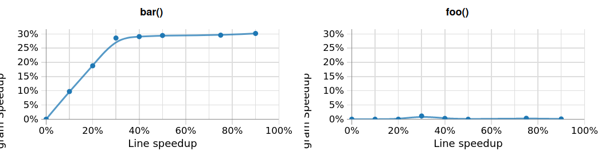

.. meta::
   :description: Omnitrace documentation and reference
   :keywords: Omnitrace, ROCm, profiler, tracking, visualization, tool, Instinct, accelerator, AMD

****************************************************
Performing causal profiling
****************************************************

The process of causal profiling can be summarized as:

*If you speed up a given block of code by X%, the application will run Y% faster*.

Causal profiling directs parallel application developers to where they should focus their optimization
efforts by quantifying the potential impact of optimizations. Causal profiling is rooted in the concept
that *software execution speed is relative*. Speeding up a block of code by X% is mathematically equivalent
to that block of code running at its current speed if all the other code is running slower by X%.
Thus, causal profiling works by performing experiments on blocks of code during program execution which
insert pauses to slow down all other concurrently running code. During post-processing, these experiments
are translated into calculations for the potential impact of speeding up this block of code.

.. note::

   Causal profiling supersedes the original critical trace feature, which was removed in Omnitrace v1.11.0.

Consider the following C++ code executing ``foo`` and ``bar`` concurrently in two different threads
where ``foo`` is ideally 30% faster than ``bar``:

.. code-block:: cpp

   #include <cstddef>
   #include <thread>
   constexpr size_t FOO_N =  7 * 1000000000UL;
   constexpr size_t BAR_N = 10 * 1000000000UL;

   void foo()
   {
      for(volatile size_t i = 0; i < FOO_N; ++i) {}
   }

   void bar()
   {
      for(volatile size_t i = 0; i < BAR_N; ++i) {}
   }

   int main()
   {
      std::thread _threads[] = { std::thread{ foo },
                        std::thread{ bar } };

      for(auto& itr : _threads)
         itr.join();
   }

No matter how many optimizations are applied to ``foo``, the application will always 
require the same amount of time
because the end-to-end performance is limited by ``bar``. However, a 5% speed-up 
in ``bar`` results in the
end-to-end performance improving by 5%. This trend continues linearly, with a 10% speed-up 
in ``bar`` yielding a 10% speed-up in
end-to-end performance, and so on, up to a 30% speed-up, at which point ``bar`` runs as fast as ``foo``.
Any speed-up to ``bar`` beyond 30% still only yields an end-to-end performance 
improvement of 30% because the application
is now limited by performance of ``foo``, as demonstrated below in the causal 
profiling visualization:

The full details of the causal profiling methodology can be found in the paper 
`Coz: Finding Code that Counts with Causal Profiling <http://arxiv.org/pdf/1608.03676v1.pdf>`_.
The author's implementation is publicly available on `GitHub <https://github.com/plasma-umass/coz>`_.

Getting started
========================================

To effectively use causal profiling, it is important to understand a few key 
concepts, such as progress points.

Progress points
-----------------------------------

Causal profiling requires "progress points" to track progress through the code 
in between samples. Progress points must be triggered in a deterministic manner via instrumentation.
This can happen in three different ways:

* `Omnitrace <https://github.com/ROCm/omnitrace>`_ can leverage the callbacks from 
  Kokkos-Tools, OpenMP-Tools, roctracer, etc. and the wrappers around functions for 
  MPI, NUMA, RCCL, etc. to act as progress points
* Users can leverage the :doc:`runtime instrumentation capabilities <./instrumenting-rewriting-binary-application>` 
  to insert progress points
* Users can leverage :doc:`User APIs <../how-to/using-omnitrace-api>`, 
  such as ``OMNITRACE_CAUSAL_PROGRESS``

.. note::

   Binary rewrite to insert progress points is not supported. When a rewritten binary 
   runs, Dyninst translates the instruction pointer address in order to perform 
   the instrumentation. As a result, call stack samples never return instruction 
   pointer addresses within the valid Omnitrace range.

Key concepts
-----------------------------------

+------------------+-------------------------------------+----------------------------------+--------------------------------------------+
| Concept          | Setting                             | Options                          | Description                                |
+==================+=====================================+==================================+============================================+
| Backend          | ``OMNITRACE_CAUSAL_BACKEND``        | ``perf``, ``timer``              | Backend for recording samples required     |
|                  |                                     |                                  | to calculate the virtual speed-up          |
+------------------+-------------------------------------+----------------------------------+--------------------------------------------+
| Mode             | ``OMNITRACE_CAUSAL_MODE``           | ``function``, ``line``           | Select an entire function or individual    |
|                  |                                     |                                  | line of code for causal experiments        |
+------------------+-------------------------------------+----------------------------------+--------------------------------------------+
| End-to-end       | ``OMNITRACE_CAUSAL_END_TO_END``     | Boolean                          | Perform a single experiment during the     |
|                  |                                     |                                  | entire run (does not require               |
|                  |                                     |                                  | progress points)                           |
+------------------+-------------------------------------+----------------------------------+--------------------------------------------+
| Fixed speed-up   | ``OMNITRACE_CAUSAL_FIXED_SPEEDUP``  | one or more values from [0, 100] | Virtual speed-up or pool of virtual        |
|                  |                                     |                                  | speed-ups to randomly select               |
+------------------+-------------------------------------+----------------------------------+--------------------------------------------+
| Binary scope     | ``OMNITRACE_CAUSAL_BINARY_SCOPE``   | regular expression(s)            | Dynamic binaries containing code for       |
|                  |                                     |                                  | experiments                                |
+------------------+-------------------------------------+----------------------------------+--------------------------------------------+
| Source scope     | ``OMNITRACE_CAUSAL_SOURCE_SCOPE``   | regular expression(s)            | ``<file>`` and/or ``<file>:<line>``        |
|                  |                                     |                                  | containing code to include in experiments  |
+------------------+-------------------------------------+----------------------------------+--------------------------------------------+
| Function scope   | ``OMNITRACE_CAUSAL_FUNCTION_SCOPE`` | regular expression(s)            | Restricts experiments to matching          |
|                  |                                     |                                  | functions (function mode) or lines of      |
|                  |                                     |                                  | code within matching functions (line mode) |
+------------------+-------------------------------------+----------------------------------+--------------------------------------------+

.. note::

   * Binary scope defaults to ``%MAIN%`` (in the executable), but the scope can be expanded to include linked libraries.
   * ``<file>`` and ``<file>:<line>`` support requires debug info (for example, the code must be compiled with ``-g`` or, preferably, with ``-g3``)
   * Function mode does not require debug info but does not support stripped binaries

Backends
-----------------------------------

There are two backends to choose from: ``perf`` and ``timer``. 
They are used to record the samples required to calculate the virtual speedup. 
Both backends interrupt each thread 1000 times per second (of CPU-time) to apply the virtual speed-ups.
The difference between each backend is how the samples are recorded.
There are three key differences between the two backends:

* the ``perf`` backend requires Linux Perf and elevated security priviledges
* the ``perf`` backend interrupts the application less frequently whereas the ``timer`` backend 
  interrupts the application 1000 times per second of realtime
* the ``timer`` backend has less accurate call stacks due to instruction pointer skid

In general, the ``perf`` backend is preferred over the ``timer`` backend when sufficient 
security priviledges permit its usage.
If ``OMNITRACE_CAUSAL_BACKEND`` is set to ``auto``, Omnitrace falls back 
to using the ``timer`` backend only if
the ``perf`` backend fails. If ``OMNITRACE_CAUSAL_BACKEND`` is 
set to ``perf`` and using this backend fails, Omnitrace aborts.

Instruction pointer skid
^^^^^^^^^^^^^^^^^^^^^^^^^^^^^^^^

Instruction pointer (IP) skid measures how many instructions run after the event of interest
before the program actually stops. The IP skid is calculated by subtracting
the location of the IP at the point of interest from the location of the IP 
when the kernel finally stops the application.
For the ``timer`` backend, this translates to the
difference in the IP between when the timer generated a signal and when the
signal was actually generated. Although IP skid still occurs with the ``perf`` backend,
it is much more pronounced with the ``timer`` backend due to the overhead of pausing the entire thread.
This means the ``timer`` backend tends to have a lower resolution than the ``perf`` backend,
especially in ``line`` mode.

Installing Linux Perf
^^^^^^^^^^^^^^^^^^^^^^^^^^^^^^^^

Linux Perf is built into the kernel and may already be installed 
(for instance, it is included in the default kernel for OpenSUSE).
The official method of checking whether Linux Perf is installed is 
checking for the existence of the file
``/proc/sys/kernel/perf_event_paranoid``. If the file exists, the kernel has Perf installed.

If this file does not exist, as with Debian-based systems like Ubuntu, run the following command as superuser:

.. code-block:: shell

   apt-get install linux-tools-common linux-tools-generic linux-tools-$(uname -r)

and reboot your computer. In order to use the ``perf`` backend, the value 
of ``/proc/sys/kernel/perf_event_paranoid``
should be less than or equal to 2. If the value in this file is greater than 2, you can't 
use the ``perf`` backend.

To update the paranoid level temporarily until the system is rebooted, run 
one of the following commands
as a superuser (where ``PARANOID_LEVEL=<N>`` has a value of ``<N>`` in the range ``[-1, 2]``):

.. code-block:: shell

   echo ${PARANOID_LEVEL} | sudo tee /proc/sys/kernel/perf_event_paranoid

or

.. code-block:: shell

   sysctl kernel.perf_event_paranoid=${PARANOID_LEVEL}

To make the paranoid level persistent after a reboot, add ``kernel.perf_event_paranoid=<N>``
(where ``<N>`` is the desired paranoid level) to the ``/etc/sysctl.conf`` file.

Speed-up prediction variability and the omnitrace-causal executable
-----------------------------------------------------------------------

Causal profiling typically requires running the application several times in 
order to adequately sample all the code domains, experiment 
with speed-ups and other techniques, and resolve statistical fluctuations.
The ``omnitrace-causal`` executable is designed to simplify this procedure:

.. code-block:: shell

   $ omnitrace-causal --help
   [omnitrace-causal] Usage: ./bin/omnitrace-causal [ --help (count: 0, dtype: bool)
                                                      --version (count: 0, dtype: bool)
                                                      --monochrome (max: 1, dtype: bool)
                                                      --debug (max: 1, dtype: bool)
                                                      --verbose (count: 1)
                                                      --config (min: 0, dtype: filepath)
                                                      --launcher (count: 1, dtype: executable)
                                                      --generate-configs (min: 0, dtype: folder)
                                                      --no-defaults (min: 0, dtype: bool)
                                                      --mode (count: 1, dtype: string)
                                                      --output-name (min: 1, dtype: filename)
                                                      --reset (max: 1, dtype: bool)
                                                      --end-to-end (max: 1, dtype: bool)
                                                      --wait (count: 1, dtype: seconds)
                                                      --duration (count: 1, dtype: seconds)
                                                      --iterations (count: 1, dtype: int)
                                                      --speedups (min: 0, dtype: integers)
                                                      --binary-scope (min: 0, dtype: integers)
                                                      --source-scope (min: 0, dtype: integers)
                                                      --function-scope (min: 0, dtype: regex-list)
                                                      --binary-exclude (min: 0, dtype: integers)
                                                      --source-exclude (min: 0, dtype: integers)
                                                      --function-exclude (min: 0, dtype: regex-list)
                                                   ]

      Causal profiling usually requires multiple runs to reliably resolve the speedup estimates.
      This executable is designed to streamline that process.
      For example (assume all commands end with \'-- <exe> <args>\'):

         omnitrace-causal -n 5 -- <exe>                  # runs <exe> 5x with causal profiling enabled

         omnitrace-causal -s 0 5,10,15,20                # runs <exe> 2x with virtual speedups:
                                                         #   - 0
                                                         #   - randomly selected from 5, 10, 15, and 20

         omnitrace-causal -F func_A func_B func_(A|B)    # runs <exe> 3x with the function scope limited to:
                                                         #   1. func_A
                                                         #   2. func_B
                                                         #   3. func_A or func_B
      General tips:
      - Insert progress points at hotspots in your code or use omnitrace\'s runtime instrumentation
         - Note: binary rewrite will produce a incompatible new binary
      - Run omnitrace-causal in "function" mode first (does not require debug info)
      - Run omnitrace-causal in "line" mode when you are targeting one function (requires debug info)
         - Preferably, use predictions from the "function" mode to determine which function to target
      - Limit the virtual speedups to a smaller pool, e.g., 0,5,10,25,50, to get reliable predictions quicker
      - Make use of the binary, source, and function scope to limit the functions/lines selected for experiments
         - Note: source scope requires debug info

   Options:
      -h, -?, --help                 Shows this page
      --version                      Prints the version and exit

      [DEBUG OPTIONS]

      --monochrome                   Disable colorized output
      --debug                        Debug output
      -v, --verbose                  Verbose output

      [GENERAL OPTIONS]

      -c, --config                   Base configuration file
      -l, --launcher                 When running MPI jobs, omnitrace-causal needs to be *before* the executable which launches the MPI processes (i.e.
                                    before `mpirun`, `srun`, etc.). Pass the name of the target executable (or a regex for matching to the name of the
                                    target) for causal profiling, e.g., `omnitrace-causal -l foo -- mpirun -n 4 foo`. This ensures that the omnitrace
                                    library is LD_PRELOADed on the proper target
      -g, --generate-configs         Generate config files instead of passing environment variables directly. If no arguments are provided, the config files
                                    will be placed in ${PWD}/omnitrace-causal-config folder
      --no-defaults                  Do not activate default features which are recommended for causal profiling. For example: PID-tagging of output files
                                    and timestamped subdirectories are disabled by default. Kokkos tools support is added by default
                                    (OMNITRACE_USE_KOKKOSP=ON) because, for Kokkos applications, the Kokkos-Tools callbacks are used for progress points.
                                    Activation of OpenMP tools support is similar

      [CAUSAL PROFILING OPTIONS (General)]
                                    (These settings will be applied to all causal profiling runs)

      -m, --mode [ function (func) | line ]
                                    Causal profiling mode
      -o, --output-name              Output filename of causal profiling data w/o extension
      -r, --reset                    Overwrite any existing experiment results during the first run
      -e, --end-to-end               Single causal experiment for the entire application runtime
      -w, --wait                     Set the wait time (i.e. delay) before starting the first causal experiment (in seconds)
      -d, --duration                 Set the length of time (in seconds) to perform causal experimentationafter the first experiment is started. Once this
                                    amount of time has elapsed, no more causal experiments will be started but any currently running experiment will be
                                    allowed to finish.
      -n, --iterations               Number of times to repeat the combination of run configurations

      [CAUSAL PROFILING OPTIONS (Combinatorial)]
                                    (Each individual argument to these options will multiply the number runs by the number of arguments and the number of
                                    iterations. E.g. -n 2 -B "MAIN" -F "foo" "bar" will produce 4 runs: 2 iterations x 1 binary scope x 2 function scopes
                                    (MAIN+foo, MAIN+bar, MAIN+foo, MAIN+bar))

      -s, --speedups                 Pool of virtual speedups to sample from during experimentation. Each space designates a group and multiple speedups can
                                    be grouped together by commas, e.g. -s 0 0,10,20-50 is two groups: group #1 is \'0\' and group #2 is \'0 10 20 25 30 35 40
                                    45 50\'
      -B, --binary-scope             Restricts causal experiments to the binaries matching the list of regular expressions. Each space designates a group
                                    and multiple scopes can be grouped together with a semi-colon
      -S, --source-scope             Restricts causal experiments to the source files or source file + lineno pairs (i.e. <file> or <file>:<line>) matching
                                    the list of regular expressions. Each space designates a group and multiple scopes can be grouped together with a
                                    semi-colon
      -F, --function-scope           Restricts causal experiments to the functions matching the list of regular expressions. Each space designates a group
                                    and multiple scopes can be grouped together with a semi-colon
      -BE, --binary-exclude          Excludes causal experiments from being performed on the binaries matching the list of regular expressions. Each space
                                    designates a group and multiple excludes can be grouped together with a semi-colon
      -SE, --source-exclude          Excludes causal experiments from being performed on the code from the source files or source file + lineno pair (i.e.
                                    <file> or <file>:<line>) matching the list of regular expressions. Each space designates a group and multiple excludes
                                    can be grouped together with a semi-colon
      -FE, --function-exclude        Excludes causal experiments from being performed on the functions matching the list of regular expressions. Each space
                                    designates a group and multiple excludes can be grouped together with a semi-colon

Examples
^^^^^^^^^^^^^^^^^^^^^^^^^^^^^^^^

.. code-block:: shell

   #!/bin/bash -e

   module load omnitrace

   N=20
   I=3

   # when providing speedups to omnitrace-causal, speedup
   # groups are separated by a space so "0,10" results in
   # one speedup group where omnitrace samples from
   # the speedup set of {0, 10}. Passing "0 10" (without
   # quotes to omnitrace-causal multiplies the
   # number of runs by 2, where the first half of the
   # runs instruct omnitrace to only use 0 as the
   # speedup and the second half of the runs instruct
   # omnitrace to only use 10 as the speedup.
   SPEEDUPS="0,0,0,10,20,30,40,50,50,75,75,75,90,90,90"
   # thus, -s ${SPEEDUPS} only multiplies the number
   # of runs by 1 whereas -S ${SPEEDUPS_E2E} multiplies
   # the number of runs by 15:
   #   - 3 runs with speedup of 0
   #   - 1 run for each of the speedups 10, 20, 30, and 40
   #   - 2 runs with speedup of 50
   #   - 3 runs with speedup of 75
   #   - 3 runs with speedup of 90
   SPEEDUPS_E2E=$(echo "${SPEEDUPS}" | sed \'s/,/ /g\')

   # 20 iterations in function mode with 1 speedup group
   # and source scope set to .cpp files
   #
   # outputs to files:
   #   - causal/experiments.func.coz
   #   - causal/experiments.func.json
   #
   # total executions: 20
   #
   omnitrace-causal        \
      -n ${N}             \
      -s ${SPEEDUPS}      \
      -m function         \
      -o experiments.func \
      -S ".*\\.cpp"       \
      --                  \
      ./causal-omni-cpu "${@}"

   # 20 iterations in line mode with 1 speedup group
   # and source scope restricted to lines 100 and 110
   # in the causal.cpp file.
   #
   # outputs to files:
   #   - causal/experiments.line.coz
   #   - causal/experiments.line.json
   #
   # total executions: 20
   #
   omnitrace-causal                \
      -n ${N}                     \
      -s ${SPEEDUPS}              \
      -m line                     \
      -o experiments.line         \
      -S "causal\\.cpp:(100|110)" \
      --                          \
      ./causal-omni-cpu "${@}"

   # 3 iterations in function mode of 15 singular speedups
   # in end-to-end mode with 2 different function scopes
   # where one is restricted to "cpu_slow_func" and
   # another is restricted to "cpu_fast_func".
   #
   # outputs to files:
   #   - causal/experiments.func.e2e.coz
   #   - causal/experiments.func.e2e.json
   #
   # total executions: 90
   #
   omnitrace-causal            \
      -n ${I}                 \
      -s ${SPEEDUPS_E2E}      \
      -m func                 \
      -e                      \
      -o experiments.func.e2e \
      -F "cpu_slow_func"      \
         "cpu_fast_func"      \
      --                      \
      ./causal-omni-cpu "${@}"

   # 3 iterations in line mode of 15 singular speedups
   # in end-to-end mode with 2 different source scopes
   # where one is restricted to line 100 in causal.cpp
   # and another is restricted to line 110 in causal.cpp.
   #
   # outputs to files:
   #   - causal/experiments.line.e2e.coz
   #   - causal/experiments.line.e2e.json
   #
   # total executions: 90
   #
   omnitrace-causal            \
      -n ${I}                 \
      -s ${SPEEDUPS_E2E}      \
      -m line                 \
      -e                      \
      -o experiments.line.e2e \
      -S "causal\\.cpp:100"   \
         "causal\\.cpp:110"   \
      --                      \
      ./causal-omni-cpu "${@}"

   export OMP_NUM_THREADS=8
   export OMP_PROC_BIND=spread
   export OMP_PLACES=threads

   # set number of iterations to 5
   N=5

   # 5 iterations in function mode of 1 speedup
   # group with the source scope restricted
   # to files containing "lulesh" in their filename
   # and exclude functions which start with "Kokkos::"
   # or "std::enable_if".
   #
   # outputs to files:
   #   - causal/experiments.func.coz
   #   - causal/experiments.func.json
   #
   # total executions: 5
   #
   # First of 5 executions overwrites any
   # existing causal/experiments.func.(coz|json)
   # file due to "--reset" argument
   #
   omnitrace-causal                            \
      --reset                                 \
      -n ${N}                                 \
      -s ${SPEEDUPS}                          \
      -m func                                 \
      -o experiments.func                     \
      -S "lulesh.*"                           \
      -FE "^(Kokkos::|std::enable_if)"        \
      --                                      \
      ./lulesh-omni -i 50 -s 200 -r 20 -b 5 -c 5 -p

   # 5 iterations in line mode of 1 speedup
   # group with the source scope restricted
   # to files containing "lulesh" in their filename
   # and exclude functions which start with "exec_range"
   # or "execute" and which contain either
   # "construct_shared_allocation" or "._omp_fn." in
   # the function name.
   #
   # outputs to files:
   #   - causal/experiments.line.coz
   #   - causal/experiments.line.json
   #
   # total executions: 5
   #
   # First of 5 executions overwrites any
   # existing causal/experiments.line.(coz|json)
   # file due to "--reset" argument
   #
   omnitrace-causal                            \
      --reset                                 \
      -n ${N}                                 \
      -s ${SPEEDUPS}                          \
      -m line                                 \
      -o experiments.line                     \
      -S "lulesh.*"                           \
      -FE "^(exec_range|execute);construct_shared_allocation;\\._omp_fn\\." \
      --                                      \
      ./lulesh-omni -i 50 -s 200 -r 20 -b 5 -c 5 -p

   # 5 iterations in line mode of 1 speedup
   # group with the source scope restricted
   # to files whose basename is "lulesh.cc"
   # for 3 different functions:
   #   - ApplyMaterialPropertiesForElems
   #   - CalcHourglassControlForElems
   #   - CalcVolumeForceForElems
   #
   # outputs to files:
   #   - causal/experiments.line.targeted.coz
   #   - causal/experiments.line.targeted.json
   #
   # total executions: 15
   #
   # First of 5 executions overwrites any
   # existing causal/experiments.line.(coz|json)
   # file due to "--reset" argument
   #
   omnitrace-causal                            \
      --reset                                 \
      -n ${N}                                 \
      -s ${SPEEDUPS}                          \
      -m line                                 \
      -o experiments.line.targeted            \
      -F "ApplyMaterialPropertiesForElems"    \
         "CalcHourglassControlForElems"       \
         "CalcVolumeForceForElems"            \
      -S "lulesh\\.cc"                        \
      --                                      \
      ./lulesh-omni -i 50 -s 200 -r 20 -b 5 -c 5 -p

Using omnitrace-causal with other launchers like mpirun
^^^^^^^^^^^^^^^^^^^^^^^^^^^^^^^^^^^^^^^^^^^^^^^^^^^^^^^^^^^^^^^^^^^^

The ``omnitrace-causal`` executable is intended to assist with application replay 
and is designed to always be at the start of the command line as the primary process.
``omnitrace-causal`` typically adds a ``LD_PRELOAD`` of the Omnitrace libraries 
into the environment before launching the command to inject the functionality
required to start the causal profiling tooling. However, this is problematic 
when the target application for causal profiling uses a launcher, in which case 
it is listed as an argument rather than as the main application. For example, 
``foo`` is the target application for profiling, but the command to run it is 
``mpirun -n 2 foo``. Running the command ``omnitrace-causal -- mpirun -n 2 foo`` 
applies the causal profiling to ``mpirun`` instead of ``foo``. 

``omnitrace-causal`` remedies this by providing a command-line option ``-l` / `--launcher``
to indicate the target application is using a launcher script/executable. The 
argument to the command-line option is the name of, or regular expression for, the target application
on the command line. When ``--launcher`` is used, ``omnitrace-causal`` generates 
all the replay configurations and runs them but delays adding the ``LD_PRELOAD``. Instead it
inserts a call to itself into the command line right before the target 
application. This recursive call inherits the configuration from
the parent ``omnitrace-causal`` executable, inserts an ``LD_PRELOAD`` into the environment, 
and calls ``execv`` to replace itself with the new process launched by the target
application.

In other words, the following command:

.. code-block:: shell

   omnitrace-causal -l foo -n 3 -- mpirun -n 2 foo`

Effectively results in:

.. code-block:: shell

   mpirun -n 2 omnitrace-causal -- foo
   mpirun -n 2 omnitrace-causal -- foo
   mpirun -n 2 omnitrace-causal -- foo

Visualizing the causal output
-------------------------------------------------------------------------

Omnitrace generates ``causal/experiments.json`` and ``causal/experiments.coz`` in 
``${OMNITRACE_OUTPUT_PATH}/${OMNITRACE_OUTPUT_PREFIX}``. Visit 
`plasma-umass.org/coz <https://plasma-umass.org/coz/>`_ to open the ``*.coz`` file.

Omnitrace versus Coz
=======================================

This comparison is intended for readers who are familiar with the 
`Coz profiler <https://github.com/plasma-umass/coz>`_.
Omnitrace provides several additional features and utilities for causal profiling:

.. csv-table:: 
   :header: "Feature", "Coz", "Omnitrace", "Notes"
   :widths: 20, 60, 60, 30

   "Debug info", "requires debug info in DWARF v3 format (``-gdwarf-3``)", "optional, supports any DWARF format version", "See Note #1 below"
   "Experiment selection", "``<file>:<line>``", "``<function>`` or ``<file>:<line>``", "See Note #2 below"
   "Experiment speed-ups", "Randomly samples b/t 0..100 in increments of 5 or one fixed speed-up", "Supports specifying smaller subset", "See Note #3 below"
   "Scope options", "Supports binary and source scopes", "Supports binary, source, and function scopes", "See Note #4, #5, and #6 below"
   "Scope inclusion", "Uses ``%`` as a wildcard for binary and source scopes", "Full regex support for binary, source, and function scopes", ""
   "Scope exclusion", "Not supported", "Supports regexes for excluding binary/source/function", "See Note #7 below"
   "Call-stack sampling", "Linux Perf", "Linux Perf, libunwind", "See Note #8 below"

.. note::

  #. Omnitrace supports a "function" mode which does not require debug info.
  #. Omnitrace supports selecting an entire range of instruction pointers for a function instead 
     of an instruction pointer for one line. In large code bases, "function" mode
     can resolve in fewer iterations. After a target function is identified, you can 
     switch to line mode and limit the function scope to the target function.
  #. Omnitrace supports randomly sampling from subsets, e.g. { 0, 0, 5, 10 } 
     where 0% is randomly selected 50% of time and 5% and 10% are randomly selected 25% of the time.
  #. Omnitrace and COZ have the same definition for binary scope, which is the binaries 
     loaded at runtime (the executable and linked libraries).
  #. Omnitrace "source scope" supports both ``<file>`` and ``<file>:<line>`` formats 
     in contrast to the COZ "source scope" which requires ``<file>:<line>`` format.
  #. Omnitrace supports a "function" scope which narrows the function and lines 
     which are eligible for causal experiments to those within the matching functions.
  #. Omnitrace supports a second filter on scopes for removing binary/source/function 
     caught by an inclusive match. For example ``BINARY_SCOPE=.*`` and ``BINARY_EXCLUDE=libmpi.*``
     initially includes all binaries but exclude regex removes MPI libraries.
  #. In Omnitrace, the Linux Perf backend is preferred over use libunwind. However, 
     Linux Perf usage can be restricted for security reasons.
     Omnitrace falls back to using a second POSIX timer and libunwind if 
     Linux Perf is not available.
