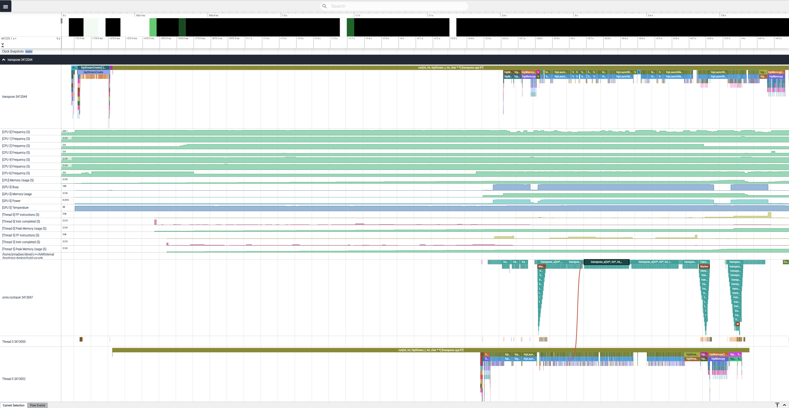
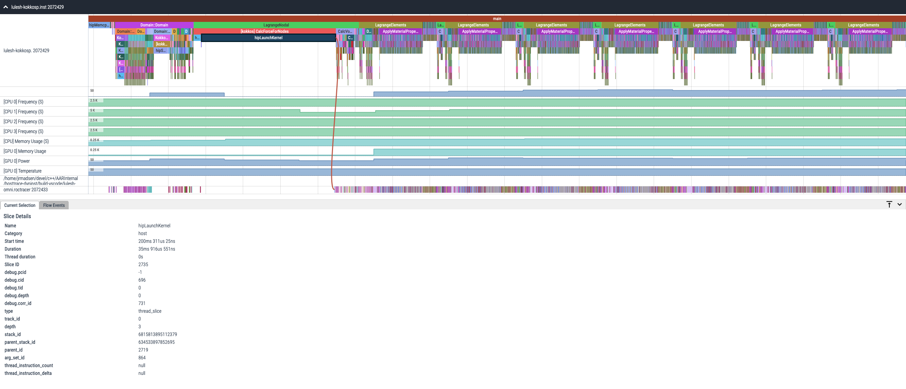
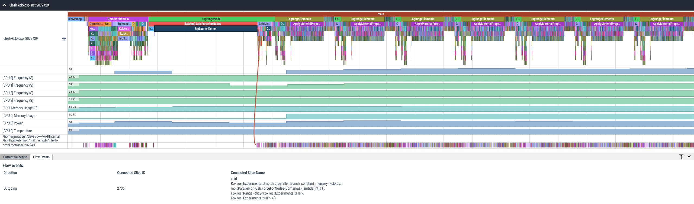
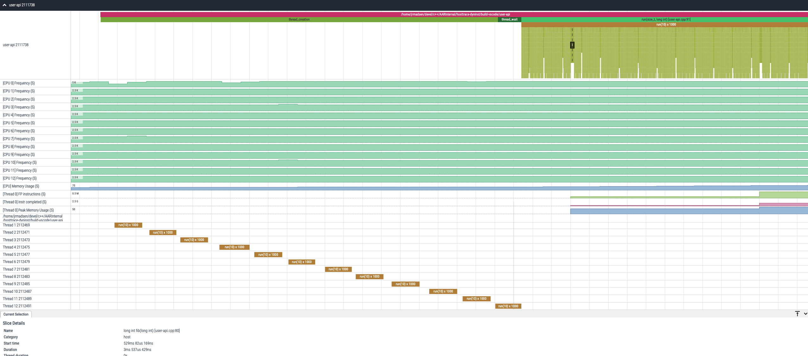

.. meta::
   :description: Omnitrace documentation and reference
   :keywords: Omnitrace, ROCm, profiler, tracking, visualization, tool, Instinct, accelerator, AMD

****************************************************
Understanding the Omnitrace output
****************************************************

The general output form of `Omnitrace <https://github.com/ROCm/omnitrace>`_ is
``<OUTPUT_PATH>[/<TIMESTAMP>]/[<PREFIX>]<DATA_NAME>[-<OUTPUT_SUFFIX>].<EXT>``.

For example, starting with the following base configuration:

.. code-block:: shell

   export OMNITRACE_OUTPUT_PATH=omnitrace-example-output
   export OMNITRACE_TIME_OUTPUT=ON
   export OMNITRACE_USE_PID=OFF
   export OMNITRACE_PROFILE=ON
   export OMNITRACE_TRACE=ON

.. code-block:: shell

   $ omnitrace-instrument -- ./foo
   ...
   [omnitrace] Outputting 'omnitrace-example-output/perfetto-trace.proto'...

   [omnitrace] Outputting 'omnitrace-example-output/wall-clock.txt'...
   [omnitrace] Outputting 'omnitrace-example-output/wall-clock.json'...

If the ``OMNITRACE_USE_PID`` option is enabled, then running a non-MPI executable
with a PID of ``63453`` results in the following output:

.. code-block:: shell

   $ export OMNITRACE_USE_PID=ON
   $ omnitrace-instrument -- ./foo
   ...
   [omnitrace] Outputting 'omnitrace-example-output/perfetto-trace-63453.proto'...

   [omnitrace] Outputting 'omnitrace-example-output/wall-clock-63453.txt'...
   [omnitrace] Outputting 'omnitrace-example-output/wall-clock-63453.json'...

If ``OMNITRACE_TIME_OUTPUT`` is enabled, then a job that started on January 31, 2022 at 12:30 PM
generates the following:

.. code-block:: shell

   $ export OMNITRACE_TIME_OUTPUT=ON
   $ omnitrace-instrument -- ./foo
   ...
   [omnitrace] Outputting 'omnitrace-example-output/2022-01-31_12.30_PM/perfetto-trace-63453.proto'...

   [omnitrace] Outputting 'omnitrace-example-output/2022-01-31_12.30_PM/wall-clock-63453.txt'...
   [omnitrace] Outputting 'omnitrace-example-output/2022-01-31_12.30_PM/wall-clock-63453.json'...

Metadata
========================================

Omnitrace outputs a ``metadata.json`` file. This metadata file contains
information about the settings, environment variables, output files, and info
about the system and the run, as follows:

* Hardware cache sizes
* Physical CPUs
* Hardware concurrency
* CPU model, frequency, vendor, and features
* Launch date and time
* Memory maps (for example, shared libraries)
* Output files
* Environment variables
* Configuration settings

Metadata JSON Sample
-----------------------------------------------------------------------

.. code-block:: json

   {
      "omnitrace": {
         "metadata": {
               "info": {
                  "HW_L1_CACHE_SIZE": 32768,
                  "HW_L2_CACHE_SIZE": 524288,
                  "HW_L3_CACHE_SIZE": 16777216,
                  "HW_PHYSICAL_CPU": 12,
                  "HW_CONCURRENCY": 24,
                  "LAUNCH_TIME": "02:04",
                  "LAUNCH_DATE": "05/08/22",
                  "TIMEMORY_GIT_REVISION": "52e7034fd419ff296506cdef43084f6071dbaba1",
                  "TIMEMORY_VERSION": "3.3.0rc4",
                  "TIMEMORY_API": "tim::project::timemory",
                  "TIMEMORY_GIT_DESCRIBE": "v3.2.0-263-g52e7034f",
                  "PWD": "/home/jrmadsen/devel/c++/AARInternal/hosttrace-dyninst/build-vscode",
                  "USER": "jrmadsen",
                  "HOME": "/home/jrmadsen",
                  "SHELL": "/bin/bash",
                  "CPU_MODEL": "AMD Ryzen Threadripper PRO 3945WX 12-Cores",
                  "CPU_FREQUENCY": 2400,
                  "CPU_VENDOR": "AuthenticAMD",
                  "CPU_FEATURES": [
                     "fpu",
                     "msr",
                     "sse",
                     "sse2",
                     "constant_tsc",
                     "ssse3",
                     "fma",
                     "sse4_1",
                     "sse4_2",
                     "popcnt",
                     "avx2",
                     "... etc. ..."
                  ],
                  "memory_maps": [
                     {
                           "end_address": "7f4013797000",
                           "start_address": "7f4012e58000",
                           "pathname": "/opt/rocm-5.0.0/hip/lib/libamdhip64.so.5.0.50000",
                           "offset": "34a000",
                           "device": "103:05",
                           "inode": 4331165,
                           "permissions": "rw-p"
                     },
                     {
                           "end_address": "7f4013902000",
                           "start_address": "7f4013901000",
                           "pathname": "/usr/lib/x86_64-linux-gnu/libm-2.31.so",
                           "offset": "14d000",
                           "device": "103:05",
                           "inode": 42078854,
                           "permissions": "rwxp"
                     },
                     {
                           "end_address": "7f4013919000",
                           "start_address": "7f4013908000",
                           "pathname": "/usr/lib/x86_64-linux-gnu/libpthread-2.31.so",
                           "offset": "6000",
                           "device": "103:05",
                           "inode": 42078874,
                           "permissions": "r-xp"
                     },
                     {
                           "...": "etc."
                     },
                  ],
                  "memory_maps_files": [
                     "/opt/rocm-5.0.0/hip/lib/libamdhip64.so.5.0.50000",
                     "/opt/rocm-5.0.0/hsa-amd-aqlprofile/lib/libhsa-amd-aqlprofile64.so.1.0.50000",
                     "/opt/rocm-5.0.0/lib/libamd_comgr.so.2.4.50000",
                     "/opt/rocm-5.0.0/lib/libhsa-runtime64.so.1.5.50000",
                     "/opt/rocm-5.0.0/rocm_smi/lib/librocm_smi64.so.5.0.50000",
                     "/opt/rocm-5.0.0/roctracer/lib/libroctracer64.so.1.0.50000",
                     "/usr/lib/x86_64-linux-gnu/ld-2.31.so",
                     "/usr/lib/x86_64-linux-gnu/libc-2.31.so",
                     "/usr/lib/x86_64-linux-gnu/libdl-2.31.so",
                     "... etc. ..."
                  ],
               },
               "output": {
                  "text": [
                     {
                           "value": [
                              "omnitrace-tests-output/parallel-overhead-binary-rewrite/roctracer.txt"
                           ],
                           "key": "roctracer"
                     },
                     {
                           "value": [
                              "omnitrace-tests-output/parallel-overhead-binary-rewrite/wall_clock.txt"
                           ],
                           "key": "wall_clock"
                     }
                  ],
                  "json": [
                     {
                           "value": [
                              "omnitrace-tests-output/parallel-overhead-binary-rewrite/roctracer.json",
                              "omnitrace-tests-output/parallel-overhead-binary-rewrite/roctracer.tree.json"
                           ],
                           "key": "roctracer"
                     },
                     {
                           "value": [
                              "omnitrace-tests-output/parallel-overhead-binary-rewrite/wall_clock.json",
                              "omnitrace-tests-output/parallel-overhead-binary-rewrite/wall_clock.tree.json"
                           ],
                           "key": "wall_clock"
                     }
                  ]
               },
               "environment": [
                  {
                     "value": "/home/jrmadsen",
                     "key": "HOME"
                  },
                  {
                     "value": "/bin/bash",
                     "key": "SHELL"
                  },
                  {
                     "value": "jrmadsen",
                     "key": "USER"
                  },
                  {
                     "value": "true",
                     "key": "... etc. ..."
                  }
               ],
               "settings": {
                  "OMNITRACE_JSON_OUTPUT": {
                     "count": -1,
                     "environ_updated": false,
                     "name": "json_output",
                     "data_type": "bool",
                     "initial": true,
                     "enabled": true,
                     "value": true,
                     "max_count": 1,
                     "cmdline": [
                           "--omnitrace-json-output"
                     ],
                     "environ": "OMNITRACE_JSON_OUTPUT",
                     "config_updated": false,
                     "categories": [
                           "io",
                           "json",
                           "native"
                     ],
                     "description": "Write json output files"
                  },
                  "... etc. ...": {
                     "etc.": true
                  }
               }
         }
      }
   }

Configuring the Omnitrace output
========================================

Omnitrace includes a core set of options for controlling the format
and contents of the output files. For additional information, see the guide on
:doc:`configuring runtime options <./configuring-runtime-options>`.

Core configuration settings
-----------------------------------

.. csv-table::
   :header: "Setting", "Value", "Description"
   :widths: 30, 30, 100

   "``OMNITRACE_OUTPUT_PATH``", "Any valid path", "Path to folder where output files should be placed"
   "``OMNITRACE_OUTPUT_PREFIX``", "String", "Useful for multiple runs with different arguments. See the next section on output prefix keys."
   "``OMNITRACE_OUTPUT_FILE``", "Any valid filepath", "Specific location for the Perfetto output file"
   "``OMNITRACE_TIME_OUTPUT``", "Boolean", "Place all output in a timestamped folder, timestamp format controlled via ``OMNITRACE_TIME_FORMAT``"
   "``OMNITRACE_TIME_FORMAT``", "String", "See ``strftime`` man pages for valid identifiers"
   "``OMNITRACE_USE_PID``", "Boolean", "Append either the PID or the MPI rank to all output files (before the extension)"

Output prefix keys
^^^^^^^^^^^^^^^^^^^^^^^^^^^^^^^^^^^^^^^^^^^^^^^^^^^^^^^^^^^^^^^^^^^^

Output prefix keys have many uses but are most helpful when dealing with multiple
profiling runs or large MPI jobs.
They are included in Omnitrace because they were introduced into Timemory
for `compile-time-perf <https://github.com/jrmadsen/compile-time-perf>`_.
They are needed to create different output files for a generic wrapper around
compilation commands while still
overwriting the output from the last time a file was compiled.

When doing scaling studies and specifying options via the command line,
the recommended process is to
use a common ``OMNITRACE_OUTPUT_PATH``, disable ``OMNITRACE_TIME_OUTPUT``,
set ``OMNITRACE_OUTPUT_PREFIX="%argt%-"``, and let Omnitrace cleanly organize the output.

.. csv-table::
   :header: "String", "Encoding"
   :widths: 20, 120

   "``%argv%``", "Entire command-line condensed into a single string"
   "``%argt%``", "Similar to ``%argv%`` except basename of first command line argument"
   "``%args%``", "All command line arguments condensed into a single string"
   "``%tag%``", "Basename of first command line argument"
   "``%arg<N>%``", "Command line argument at position ``<N>`` (zero indexed), e.g. ``%arg0%`` for first argument"
   "``%argv_hash%``", "MD5 sum of ``%argv%``"
   "``%argt_hash%``", "MD5 sum if ``%argt%``"
   "``%args_hash%``", "MD5 sum of ``%args%``"
   "``%tag_hash%``", "MD5 sum of ``%tag%``"
   "``%arg<N>_hash%``", "MD5 sum of ``%arg<N>%``"
   "``%pid%``", "Process identifier (i.e. ``getpid()``)"
   "``%ppid%``", "Parent process identifier (i.e. ``getppid()``)"
   "``%pgid%``", "Process group identifier (i.e. ``getpgid(getpid())``)"
   "``%psid%``", "Process session identifier  (i.e. ``getsid(getpid())``)"
   "``%psize%``", "Number of sibling process (from reading ``/proc/<PPID>/tasks/<PPID>/children``)"
   "``%job%``", "Value of ``SLURM_JOB_ID`` environment variable if exists, else ``0``"
   "``%rank%``", "Value of ``SLURM_PROCID`` environment variable if exists, else ``MPI_Comm_rank`` (or ``0`` non-mpi)"
   "``%size%``", "``MPI_Comm_size`` or ``1`` if non-mpi"
   "``%nid%``", "``%rank%`` if possible, otherwise ``%pid%``"
   "``%launch_time%``", "Launch date and time (uses ``OMNITRACE_TIME_FORMAT``)"
   "``%env{NAME}%``", "Value of environment variable ``NAME`` (i.e. ``getenv(NAME)``)"
   "``%cfg{NAME}%``", "Value of configuration variable ``NAME`` (e.g. ``%cfg{OMNITRACE_SAMPLING_FREQ}%`` would resolve to sampling frequency)"
   "``$env{NAME}``", "Alternative syntax to ``%env{NAME}%``"
   "``$cfg{NAME}``", "Alternative syntax to ``%cfg{NAME}%``"
   "``%m``", "Shorthand for ``%argt_hash%``"
   "``%p``", "Shorthand for ``%pid%``"
   "``%j``", "Shorthand for ``%job%``"
   "``%r``", "Shorthand for ``%rank%``"
   "``%s``", "Shorthand for ``%size%``"

.. note::

   In any output prefix key which contains a ``/`` character, the ``/`` characters
   are replaced with ``_`` and any leading underscores are stripped. For example,
   an ``%arg0%`` of ``/usr/bin/foo`` translates to ``usr_bin_foo``. Additionally, any ``%arg<N>%`` keys which
   do not have a command line argument at position ``<N>`` are ignored.

Perfetto output
========================================

Use the ``OMNITRACE_OUTPUT_FILE`` to specify a specific location. If this is an
absolute path, then all ``OMNITRACE_OUTPUT_PATH`` and similar
settings are ignored. Visit `ui.perfetto.dev <https://ui.perfetto.dev>`_ and open
this file.

.. important::
   Perfetto validation is done with trace_processor v46.0 as there is a known issue with v47.0.
   If you are experiencing problems viewing your trace in the latest version of `Perfetto <http://ui.perfetto.dev>`_,
   then try using `Perfetto UI v46.0 <https://ui.perfetto.dev/v46.0-35b3d9845/#!/>`_.

Timemory output
========================================

Use ``omnitrace-avail --components --filename`` to view the base filename for each component, as follows

.. code-block:: shell

   $ omnitrace-avail wall_clock -C -f
   |---------------------------------|---------------|------------------------|
   |            COMPONENT            |   AVAILABLE   |        FILENAME        |
   |---------------------------------|---------------|------------------------|
   | wall_clock                      |     true      | wall_clock             |
   | sampling_wall_clock             |     true      | sampling_wall_clock    |
   |---------------------------------|---------------|------------------------|

The ``OMNITRACE_COLLAPSE_THREADS`` and ``OMNITRACE_COLLAPSE_PROCESSES`` settings are
only valid when full `MPI support is enabled <../install/install.html#mpi-support-within-omnitrace>`_.
When they are set, Timemory combines the per-thread and per-rank data (respectively) of
identical call stacks.

The ``OMNITRACE_FLAT_PROFILE`` setting removes all call stack hierarchy.
Using ``OMNITRACE_FLAT_PROFILE=ON`` in combination
with ``OMNITRACE_COLLAPSE_THREADS=ON`` is a useful configuration for identifying
min/max measurements regardless of the calling context.
The ``OMNITRACE_TIMELINE_PROFILE`` setting (with ``OMNITRACE_FLAT_PROFILE=OFF``) effectively
generates similar data to that found
in Perfetto. Enabling timeline and flat profiling effectively generates
similar data to ``strace``. However, while Timemory generally
requires significantly less memory than Perfetto, this is not the case in timeline
mode, so use this setting with caution.

Timemory text output
-----------------------------------------------------------------------

Timemory text output files are meant for human consumption (while JSON formats are for analysis),
so some fields such as the ``LABEL`` might be truncated for readability.
The truncation settings be changed through the ``OMNITRACE_MAX_WIDTH`` setting.

.. note::

   The generation of text output is configurable via ``OMNITRACE_TEXT_OUTPUT``.

.. _text-output-example-label:

Timemory text output example
^^^^^^^^^^^^^^^^^^^^^^^^^^^^^^^^^^^^^^^^^^^^^^^^^^^^^^^^^^^^^^^^^^^^

In the following example, the ``NN`` field in ``|NN>>>`` is the thread ID. If MPI support is enabled,
this becomes ``|MM|NN>>>`` where ``MM`` is the rank.
If ``OMNITRACE_COLLAPSE_THREADS=ON`` and ``OMNITRACE_COLLAPSE_PROCESSES=ON`` are configured,
neither the ``MM`` nor the ``NN`` are present unless the
component explicitly sets type traits. Type traits specify that the data is only
relevant per-thread or per-process, such as the ``thread_cpu_clock`` clock component.

.. code-block:: shell

   |-------------------------------------------------------------------------------------------------------------------------------------------------------------------------------------|
   |                                                                       REAL-CLOCK TIMER (I.E. WALL-CLOCK TIMER)                                                                      |
   |-------------------------------------------------------------------------------------------------------------------------------------------------------------------------------------|
   |                            LABEL                             | COUNT  | DEPTH  |   METRIC   | UNITS  |   SUM     |   MEAN    |   MIN     |   MAX     |   VAR    | STDDEV   | % SELF |
   |--------------------------------------------------------------|--------|--------|------------|--------|-----------|-----------|-----------|-----------|----------|----------|--------|
   | |00>>> main                                                  |      1 |      0 | wall_clock | sec    | 13.360265 | 13.360265 | 13.360265 | 13.360265 | 0.000000 | 0.000000 |   18.2 |
   | |00>>> |_ompt_thread_initial                                 |      1 |      1 | wall_clock | sec    | 10.924161 | 10.924161 | 10.924161 | 10.924161 | 0.000000 | 0.000000 |    0.0 |
   | |00>>>   |_ompt_implicit_task                                |      1 |      2 | wall_clock | sec    | 10.923050 | 10.923050 | 10.923050 | 10.923050 | 0.000000 | 0.000000 |    0.1 |
   | |00>>>     |_ompt_parallel [parallelism=12]                  |      1 |      3 | wall_clock | sec    | 10.915026 | 10.915026 | 10.915026 | 10.915026 | 0.000000 | 0.000000 |    0.0 |
   | |00>>>       |_ompt_implicit_task                            |      1 |      4 | wall_clock | sec    | 10.647951 | 10.647951 | 10.647951 | 10.647951 | 0.000000 | 0.000000 |    0.0 |
   | |00>>>         |_ompt_work_loop                              |    156 |      5 | wall_clock | sec    |  0.000812 |  0.000005 |  0.000001 |  0.000212 | 0.000000 | 0.000018 |  100.0 |
   | |00>>>         |_ompt_work_single_executor                   |     40 |      5 | wall_clock | sec    |  0.000016 |  0.000000 |  0.000000 |  0.000001 | 0.000000 | 0.000000 |  100.0 |
   | |00>>>         |_ompt_sync_region_barrier_implicit           |    308 |      5 | wall_clock | sec    |  0.000629 |  0.000002 |  0.000001 |  0.000017 | 0.000000 | 0.000002 |  100.0 |
   | |00>>>         |_conj_grad                                   |     76 |      5 | wall_clock | sec    | 10.641165 |  0.140015 |  0.131894 |  0.155099 | 0.000017 | 0.004080 |    1.0 |
   | |00>>>           |_ompt_work_single_executor                 |    803 |      6 | wall_clock | sec    |  0.000292 |  0.000000 |  0.000000 |  0.000001 | 0.000000 | 0.000000 |  100.0 |
   | |00>>>           |_ompt_work_loop                            |   7904 |      6 | wall_clock | sec    |  7.420265 |  0.000939 |  0.000005 |  0.006974 | 0.000003 | 0.001613 |  100.0 |
   | |00>>>           |_ompt_sync_region_barrier_implicit         |   6004 |      6 | wall_clock | sec    |  0.283160 |  0.000047 |  0.000001 |  0.004087 | 0.000000 | 0.000303 |  100.0 |
   | |00>>>           |_ompt_sync_region_barrier_implementation   |   3952 |      6 | wall_clock | sec    |  2.829252 |  0.000716 |  0.000007 |  0.009005 | 0.000001 | 0.000985 |   99.7 |
   | |00>>>             |_ompt_sync_region_reduction              |  15808 |      7 | wall_clock | sec    |  0.009142 |  0.000001 |  0.000000 |  0.000007 | 0.000000 | 0.000000 |  100.0 |
   | |00>>>           |_ompt_work_single_other                    |   1249 |      6 | wall_clock | sec    |  0.000270 |  0.000000 |  0.000000 |  0.000001 | 0.000000 | 0.000000 |  100.0 |
   | |00>>>         |_ompt_work_single_other                      |    114 |      5 | wall_clock | sec    |  0.000024 |  0.000000 |  0.000000 |  0.000001 | 0.000000 | 0.000000 |  100.0 |
   | |00>>>         |_ompt_sync_region_barrier_implementation     |     76 |      5 | wall_clock | sec    |  0.000876 |  0.000012 |  0.000008 |  0.000025 | 0.000000 | 0.000003 |   84.4 |
   | |00>>>           |_ompt_sync_region_reduction                |    304 |      6 | wall_clock | sec    |  0.000136 |  0.000000 |  0.000000 |  0.000001 | 0.000000 | 0.000000 |  100.0 |
   | |00>>>         |_ompt_master                                 |    226 |      5 | wall_clock | sec    |  0.001978 |  0.000009 |  0.000000 |  0.000038 | 0.000000 | 0.000012 |  100.0 |
   | |11>>>       |_ompt_thread_worker                            |      1 |      4 | wall_clock | sec    | 10.656145 | 10.656145 | 10.656145 | 10.656145 | 0.000000 | 0.000000 |    0.1 |
   | |11>>>         |_ompt_implicit_task                          |      1 |      5 | wall_clock | sec    | 10.649183 | 10.649183 | 10.649183 | 10.649183 | 0.000000 | 0.000000 |    0.0 |
   | |11>>>           |_ompt_work_loop                            |    156 |      6 | wall_clock | sec    |  0.000852 |  0.000005 |  0.000002 |  0.000230 | 0.000000 | 0.000019 |  100.0 |
   | |11>>>           |_ompt_work_single_other                    |    149 |      6 | wall_clock | sec    |  0.000035 |  0.000000 |  0.000000 |  0.000000 | 0.000000 | 0.000000 |  100.0 |
   | |11>>>           |_ompt_sync_region_barrier_implicit         |    308 |      6 | wall_clock | sec    |  0.004135 |  0.000013 |  0.000001 |  0.001233 | 0.000000 | 0.000070 |  100.0 |
   | |11>>>           |_conj_grad                                 |     76 |      6 | wall_clock | sec    | 10.641302 |  0.140017 |  0.131896 |  0.155102 | 0.000017 | 0.004080 |    0.6 |
   | |11>>>             |_ompt_work_single_other                  |   2023 |      7 | wall_clock | sec    |  0.000458 |  0.000000 |  0.000000 |  0.000001 | 0.000000 | 0.000000 |  100.0 |
   | |11>>>             |_ompt_work_loop                          |   7904 |      7 | wall_clock | sec    |  8.253555 |  0.001044 |  0.000005 |  0.008021 | 0.000003 | 0.001790 |  100.0 |
   | |11>>>             |_ompt_sync_region_barrier_implicit       |   6004 |      7 | wall_clock | sec    |  0.263840 |  0.000044 |  0.000001 |  0.004087 | 0.000000 | 0.000297 |  100.0 |
   | |11>>>             |_ompt_sync_region_barrier_implementation |   3952 |      7 | wall_clock | sec    |  2.059823 |  0.000521 |  0.000007 |  0.009508 | 0.000001 | 0.000863 |  100.0 |
   | |11>>>             |_ompt_work_single_executor               |     29 |      7 | wall_clock | sec    |  0.000011 |  0.000000 |  0.000000 |  0.000001 | 0.000000 | 0.000000 |  100.0 |
   | |11>>>           |_ompt_work_single_executor                 |      5 |      6 | wall_clock | sec    |  0.000002 |  0.000000 |  0.000000 |  0.000000 | 0.000000 | 0.000000 |  100.0 |
   | |11>>>           |_ompt_sync_region_barrier_implementation   |     76 |      6 | wall_clock | sec    |  0.000975 |  0.000013 |  0.000008 |  0.000024 | 0.000000 | 0.000003 |  100.0 |
   | |10>>>       |_ompt_thread_worker                            |      1 |      4 | wall_clock | sec    | 10.681664 | 10.681664 | 10.681664 | 10.681664 | 0.000000 | 0.000000 |    0.3 |
   | |10>>>         |_ompt_implicit_task                          |      1 |      5 | wall_clock | sec    | 10.649158 | 10.649158 | 10.649158 | 10.649158 | 0.000000 | 0.000000 |    0.0 |
   | |10>>>           |_ompt_work_loop                            |    156 |      6 | wall_clock | sec    |  0.000863 |  0.000006 |  0.000002 |  0.000231 | 0.000000 | 0.000019 |  100.0 |
   | |10>>>           |_ompt_work_single_other                    |    140 |      6 | wall_clock | sec    |  0.000037 |  0.000000 |  0.000000 |  0.000001 | 0.000000 | 0.000000 |  100.0 |
   | |10>>>           |_ompt_sync_region_barrier_implicit         |    308 |      6 | wall_clock | sec    |  0.004149 |  0.000013 |  0.000001 |  0.001221 | 0.000000 | 0.000070 |  100.0 |
   | |10>>>           |_conj_grad                                 |     76 |      6 | wall_clock | sec    | 10.641288 |  0.140017 |  0.131896 |  0.155101 | 0.000017 | 0.004080 |    0.7 |
   | |10>>>             |_ompt_work_single_other                  |   1883 |      7 | wall_clock | sec    |  0.000487 |  0.000000 |  0.000000 |  0.000001 | 0.000000 | 0.000000 |  100.0 |
   | |10>>>             |_ompt_work_loop                          |   7904 |      7 | wall_clock | sec    |  8.174545 |  0.001034 |  0.000005 |  0.006899 | 0.000003 | 0.001766 |  100.0 |
   | |10>>>             |_ompt_sync_region_barrier_implicit       |   6004 |      7 | wall_clock | sec    |  0.268808 |  0.000045 |  0.000001 |  0.004087 | 0.000000 | 0.000299 |  100.0 |
   | |10>>>             |_ompt_sync_region_barrier_implementation |   3952 |      7 | wall_clock | sec    |  2.126988 |  0.000538 |  0.000007 |  0.009843 | 0.000001 | 0.000872 |   99.9 |
   | |10>>>               |_ompt_sync_region_reduction            |   3952 |      8 | wall_clock | sec    |  0.002574 |  0.000001 |  0.000000 |  0.000014 | 0.000000 | 0.000000 |  100.0 |
   | |10>>>             |_ompt_work_single_executor               |    169 |      7 | wall_clock | sec    |  0.000072 |  0.000000 |  0.000000 |  0.000001 | 0.000000 | 0.000000 |  100.0 |
   | |10>>>           |_ompt_sync_region_barrier_implementation   |     76 |      6 | wall_clock | sec    |  0.000954 |  0.000013 |  0.000009 |  0.000023 | 0.000000 | 0.000003 |   95.9 |
   | |10>>>             |_ompt_sync_region_reduction              |     76 |      7 | wall_clock | sec    |  0.000039 |  0.000001 |  0.000000 |  0.000001 | 0.000000 | 0.000000 |  100.0 |
   | |10>>>           |_ompt_work_single_executor                 |     14 |      6 | wall_clock | sec    |  0.000006 |  0.000000 |  0.000000 |  0.000001 | 0.000000 | 0.000000 |  100.0 |
   | |09>>>       |_ompt_thread_worker                            |      1 |      4 | wall_clock | sec    | 10.686552 | 10.686552 | 10.686552 | 10.686552 | 0.000000 | 0.000000 |    0.3 |
   | |09>>>         |_ompt_implicit_task                          |      1 |      5 | wall_clock | sec    | 10.649151 | 10.649151 | 10.649151 | 10.649151 | 0.000000 | 0.000000 |    0.0 |
   | |09>>>           |_ompt_work_loop                            |    156 |      6 | wall_clock | sec    |  0.000880 |  0.000006 |  0.000002 |  0.000258 | 0.000000 | 0.000021 |  100.0 |
   | |09>>>           |_ompt_work_single_other                    |    148 |      6 | wall_clock | sec    |  0.000034 |  0.000000 |  0.000000 |  0.000001 | 0.000000 | 0.000000 |  100.0 |
   | |09>>>           |_ompt_sync_region_barrier_implicit         |    308 |      6 | wall_clock | sec    |  0.004129 |  0.000013 |  0.000001 |  0.001210 | 0.000000 | 0.000069 |  100.0 |
   | |09>>>           |_conj_grad                                 |     76 |      6 | wall_clock | sec    | 10.641308 |  0.140017 |  0.131895 |  0.155102 | 0.000017 | 0.004080 |    0.7 |
   | |09>>>             |_ompt_work_single_other                  |   2043 |      7 | wall_clock | sec    |  0.000473 |  0.000000 |  0.000000 |  0.000001 | 0.000000 | 0.000000 |  100.0 |
   | |09>>>             |_ompt_work_loop                          |   7904 |      7 | wall_clock | sec    |  7.977001 |  0.001009 |  0.000005 |  0.007325 | 0.000003 | 0.001732 |  100.0 |
   | |09>>>             |_ompt_sync_region_barrier_implicit       |   6004 |      7 | wall_clock | sec    |  0.242996 |  0.000040 |  0.000001 |  0.004087 | 0.000000 | 0.000284 |  100.0 |
   | |09>>>             |_ompt_sync_region_barrier_implementation |   3952 |      7 | wall_clock | sec    |  2.350895 |  0.000595 |  0.000007 |  0.008689 | 0.000001 | 0.000926 |  100.0 |
   | |09>>>             |_ompt_work_single_executor               |      9 |      7 | wall_clock | sec    |  0.000004 |  0.000000 |  0.000000 |  0.000001 | 0.000000 | 0.000000 |  100.0 |
   | |09>>>           |_ompt_sync_region_barrier_implementation   |     76 |      6 | wall_clock | sec    |  0.000973 |  0.000013 |  0.000008 |  0.000025 | 0.000000 | 0.000003 |  100.0 |
   | |09>>>           |_ompt_work_single_executor                 |      6 |      6 | wall_clock | sec    |  0.000002 |  0.000000 |  0.000000 |  0.000000 | 0.000000 | 0.000000 |  100.0 |
   | |08>>>       |_ompt_thread_worker                            |      1 |      4 | wall_clock | sec    | 10.721622 | 10.721622 | 10.721622 | 10.721622 | 0.000000 | 0.000000 |    0.7 |
   | |08>>>         |_ompt_implicit_task                          |      1 |      5 | wall_clock | sec    | 10.649135 | 10.649135 | 10.649135 | 10.649135 | 0.000000 | 0.000000 |    0.0 |
   | |08>>>           |_ompt_work_loop                            |    156 |      6 | wall_clock | sec    |  0.000839 |  0.000005 |  0.000001 |  0.000231 | 0.000000 | 0.000019 |  100.0 |
   | |08>>>           |_ompt_work_single_other                    |    141 |      6 | wall_clock | sec    |  0.000030 |  0.000000 |  0.000000 |  0.000001 | 0.000000 | 0.000000 |  100.0 |
   | |08>>>           |_ompt_sync_region_barrier_implicit         |    308 |      6 | wall_clock | sec    |  0.004114 |  0.000013 |  0.000001 |  0.001198 | 0.000000 | 0.000069 |  100.0 |
   | |08>>>           |_conj_grad                                 |     76 |      6 | wall_clock | sec    | 10.641294 |  0.140017 |  0.131896 |  0.155101 | 0.000017 | 0.004080 |    0.6 |
   | |08>>>             |_ompt_work_single_other                  |   1742 |      7 | wall_clock | sec    |  0.000392 |  0.000000 |  0.000000 |  0.000001 | 0.000000 | 0.000000 |  100.0 |
   | |08>>>             |_ompt_work_loop                          |   7904 |      7 | wall_clock | sec    |  8.306388 |  0.001051 |  0.000005 |  0.007886 | 0.000003 | 0.001795 |  100.0 |
   | |08>>>             |_ompt_sync_region_barrier_implicit       |   6004 |      7 | wall_clock | sec    |  0.274358 |  0.000046 |  0.000001 |  0.004090 | 0.000000 | 0.000302 |  100.0 |
   | |08>>>             |_ompt_sync_region_barrier_implementation |   3952 |      7 | wall_clock | sec    |  1.991251 |  0.000504 |  0.000007 |  0.008694 | 0.000001 | 0.000844 |   99.8 |
   | |08>>>               |_ompt_sync_region_reduction            |   7904 |      8 | wall_clock | sec    |  0.003816 |  0.000000 |  0.000000 |  0.000017 | 0.000000 | 0.000000 |  100.0 |
   | |08>>>             |_ompt_work_single_executor               |    310 |      7 | wall_clock | sec    |  0.000112 |  0.000000 |  0.000000 |  0.000001 | 0.000000 | 0.000000 |  100.0 |
   | |08>>>           |_ompt_sync_region_barrier_implementation   |     76 |      6 | wall_clock | sec    |  0.000955 |  0.000013 |  0.000009 |  0.000026 | 0.000000 | 0.000003 |   93.7 |
   | |08>>>             |_ompt_sync_region_reduction              |    152 |      7 | wall_clock | sec    |  0.000060 |  0.000000 |  0.000000 |  0.000001 | 0.000000 | 0.000000 |  100.0 |
   | |08>>>           |_ompt_work_single_executor                 |     13 |      6 | wall_clock | sec    |  0.000005 |  0.000000 |  0.000000 |  0.000001 | 0.000000 | 0.000000 |  100.0 |
   | |07>>>       |_ompt_thread_worker                            |      1 |      4 | wall_clock | sec    | 10.747282 | 10.747282 | 10.747282 | 10.747282 | 0.000000 | 0.000000 |    0.9 |
   | |07>>>         |_ompt_implicit_task                          |      1 |      5 | wall_clock | sec    | 10.649093 | 10.649093 | 10.649093 | 10.649093 | 0.000000 | 0.000000 |    0.0 |
   | |07>>>           |_ompt_work_loop                            |    156 |      6 | wall_clock | sec    |  0.000923 |  0.000006 |  0.000002 |  0.000231 | 0.000000 | 0.000019 |  100.0 |
   | |07>>>           |_ompt_work_single_other                    |    152 |      6 | wall_clock | sec    |  0.000048 |  0.000000 |  0.000000 |  0.000001 | 0.000000 | 0.000000 |  100.0 |
   | |07>>>           |_ompt_sync_region_barrier_implicit         |    308 |      6 | wall_clock | sec    |  0.003981 |  0.000013 |  0.000001 |  0.001186 | 0.000000 | 0.000068 |  100.0 |
   | |07>>>           |_conj_grad                                 |     76 |      6 | wall_clock | sec    | 10.641295 |  0.140017 |  0.131896 |  0.155101 | 0.000017 | 0.004080 |    0.7 |
   | |07>>>             |_ompt_work_single_other                  |   2043 |      7 | wall_clock | sec    |  0.000648 |  0.000000 |  0.000000 |  0.000001 | 0.000000 | 0.000000 |  100.0 |
   | |07>>>             |_ompt_work_loop                          |   7904 |      7 | wall_clock | sec    |  7.978811 |  0.001009 |  0.000005 |  0.006728 | 0.000003 | 0.001732 |  100.0 |
   | |07>>>             |_ompt_sync_region_barrier_implicit       |   6004 |      7 | wall_clock | sec    |  0.199939 |  0.000033 |  0.000001 |  0.004086 | 0.000000 | 0.000255 |  100.0 |
   | |07>>>             |_ompt_sync_region_barrier_implementation |   3952 |      7 | wall_clock | sec    |  2.385843 |  0.000604 |  0.000009 |  0.009039 | 0.000001 | 0.000938 |  100.0 |
   | |07>>>             |_ompt_work_single_executor               |      9 |      7 | wall_clock | sec    |  0.000004 |  0.000000 |  0.000000 |  0.000001 | 0.000000 | 0.000000 |  100.0 |
   | |07>>>           |_ompt_sync_region_barrier_implementation   |     76 |      6 | wall_clock | sec    |  0.000905 |  0.000012 |  0.000010 |  0.000025 | 0.000000 | 0.000003 |  100.0 |
   | |07>>>           |_ompt_work_single_executor                 |      2 |      6 | wall_clock | sec    |  0.000001 |  0.000001 |  0.000000 |  0.000001 | 0.000000 | 0.000000 |  100.0 |
   | |06>>>       |_ompt_thread_worker                            |      1 |      4 | wall_clock | sec    | 10.772278 | 10.772278 | 10.772278 | 10.772278 | 0.000000 | 0.000000 |    1.1 |
   | |06>>>         |_ompt_implicit_task                          |      1 |      5 | wall_clock | sec    | 10.649092 | 10.649092 | 10.649092 | 10.649092 | 0.000000 | 0.000000 |    0.0 |
   | |06>>>           |_ompt_work_loop                            |    156 |      6 | wall_clock | sec    |  0.000888 |  0.000006 |  0.000002 |  0.000236 | 0.000000 | 0.000020 |  100.0 |
   | |06>>>           |_ompt_work_single_other                    |    153 |      6 | wall_clock | sec    |  0.000037 |  0.000000 |  0.000000 |  0.000001 | 0.000000 | 0.000000 |  100.0 |
   | |06>>>           |_ompt_sync_region_barrier_implicit         |    308 |      6 | wall_clock | sec    |  0.004090 |  0.000013 |  0.000001 |  0.001175 | 0.000000 | 0.000067 |  100.0 |
   | |06>>>           |_conj_grad                                 |     76 |      6 | wall_clock | sec    | 10.641317 |  0.140017 |  0.131896 |  0.155101 | 0.000017 | 0.004080 |    0.8 |
   | |06>>>             |_ompt_work_single_other                  |   2041 |      7 | wall_clock | sec    |  0.000476 |  0.000000 |  0.000000 |  0.000001 | 0.000000 | 0.000000 |  100.0 |
   | |06>>>             |_ompt_work_loop                          |   7904 |      7 | wall_clock | sec    |  7.467961 |  0.000945 |  0.000005 |  0.010712 | 0.000003 | 0.001627 |  100.0 |
   | |06>>>             |_ompt_sync_region_barrier_implicit       |   6004 |      7 | wall_clock | sec    |  0.250883 |  0.000042 |  0.000001 |  0.004087 | 0.000000 | 0.000285 |  100.0 |
   | |06>>>             |_ompt_sync_region_barrier_implementation |   3952 |      7 | wall_clock | sec    |  2.838733 |  0.000718 |  0.000009 |  0.009015 | 0.000001 | 0.001015 |   99.9 |
   | |06>>>               |_ompt_sync_region_reduction            |   3952 |      8 | wall_clock | sec    |  0.003334 |  0.000001 |  0.000000 |  0.000025 | 0.000000 | 0.000001 |  100.0 |
   | |06>>>             |_ompt_work_single_executor               |     11 |      7 | wall_clock | sec    |  0.000005 |  0.000000 |  0.000000 |  0.000001 | 0.000000 | 0.000000 |  100.0 |
   | |06>>>           |_ompt_sync_region_barrier_implementation   |     76 |      6 | wall_clock | sec    |  0.000940 |  0.000012 |  0.000009 |  0.000025 | 0.000000 | 0.000003 |   95.4 |
   | |06>>>             |_ompt_sync_region_reduction              |     76 |      7 | wall_clock | sec    |  0.000044 |  0.000001 |  0.000000 |  0.000001 | 0.000000 | 0.000000 |  100.0 |
   | |06>>>           |_ompt_work_single_executor                 |      1 |      6 | wall_clock | sec    |  0.000000 |  0.000000 |  0.000000 |  0.000000 | 0.000000 | 0.000000 |  100.0 |
   | |05>>>       |_ompt_thread_worker                            |      1 |      4 | wall_clock | sec    | 10.797950 | 10.797950 | 10.797950 | 10.797950 | 0.000000 | 0.000000 |    1.4 |
   | |05>>>         |_ompt_implicit_task                          |      1 |      5 | wall_clock | sec    | 10.649072 | 10.649072 | 10.649072 | 10.649072 | 0.000000 | 0.000000 |    0.0 |
   | |05>>>           |_ompt_work_loop                            |    156 |      6 | wall_clock | sec    |  0.000879 |  0.000006 |  0.000001 |  0.000248 | 0.000000 | 0.000021 |  100.0 |
   | |05>>>           |_ompt_work_single_other                    |    142 |      6 | wall_clock | sec    |  0.000034 |  0.000000 |  0.000000 |  0.000001 | 0.000000 | 0.000000 |  100.0 |
   | |05>>>           |_ompt_sync_region_barrier_implicit         |    308 |      6 | wall_clock | sec    |  0.004062 |  0.000013 |  0.000002 |  0.001163 | 0.000000 | 0.000067 |  100.0 |
   | |05>>>           |_conj_grad                                 |     76 |      6 | wall_clock | sec    | 10.641291 |  0.140017 |  0.131896 |  0.155101 | 0.000017 | 0.004080 |    0.7 |
   | |05>>>             |_ompt_work_single_other                  |   2038 |      7 | wall_clock | sec    |  0.000500 |  0.000000 |  0.000000 |  0.000001 | 0.000000 | 0.000000 |  100.0 |
   | |05>>>             |_ompt_work_loop                          |   7904 |      7 | wall_clock | sec    |  8.279191 |  0.001047 |  0.000005 |  0.006596 | 0.000003 | 0.001792 |  100.0 |
   | |05>>>             |_ompt_sync_region_barrier_implicit       |   6004 |      7 | wall_clock | sec    |  0.250939 |  0.000042 |  0.000001 |  0.004090 | 0.000000 | 0.000286 |  100.0 |
   | |05>>>             |_ompt_sync_region_barrier_implementation |   3952 |      7 | wall_clock | sec    |  2.039013 |  0.000516 |  0.000009 |  0.008689 | 0.000001 | 0.000855 |  100.0 |
   | |05>>>             |_ompt_work_single_executor               |     14 |      7 | wall_clock | sec    |  0.000005 |  0.000000 |  0.000000 |  0.000000 | 0.000000 | 0.000000 |  100.0 |
   | |05>>>           |_ompt_sync_region_barrier_implementation   |     76 |      6 | wall_clock | sec    |  0.000926 |  0.000012 |  0.000009 |  0.000023 | 0.000000 | 0.000003 |  100.0 |
   | |05>>>           |_ompt_work_single_executor                 |     12 |      6 | wall_clock | sec    |  0.000005 |  0.000000 |  0.000000 |  0.000001 | 0.000000 | 0.000000 |  100.0 |
   | |04>>>       |_ompt_thread_worker                            |      1 |      4 | wall_clock | sec    | 10.825935 | 10.825935 | 10.825935 | 10.825935 | 0.000000 | 0.000000 |    1.6 |
   | |04>>>         |_ompt_implicit_task                          |      1 |      5 | wall_clock | sec    | 10.649068 | 10.649068 | 10.649068 | 10.649068 | 0.000000 | 0.000000 |    0.0 |
   | |04>>>           |_ompt_work_loop                            |    156 |      6 | wall_clock | sec    |  0.000884 |  0.000006 |  0.000002 |  0.000245 | 0.000000 | 0.000020 |  100.0 |
   | |04>>>           |_ompt_work_single_other                    |    150 |      6 | wall_clock | sec    |  0.000034 |  0.000000 |  0.000000 |  0.000001 | 0.000000 | 0.000000 |  100.0 |
   | |04>>>           |_ompt_sync_region_barrier_implicit         |    308 |      6 | wall_clock | sec    |  0.004069 |  0.000013 |  0.000001 |  0.001151 | 0.000000 | 0.000066 |  100.0 |
   | |04>>>           |_conj_grad                                 |     76 |      6 | wall_clock | sec    | 10.641300 |  0.140017 |  0.131896 |  0.155101 | 0.000017 | 0.004080 |    1.1 |
   | |04>>>             |_ompt_work_single_other                  |   2041 |      7 | wall_clock | sec    |  0.000448 |  0.000000 |  0.000000 |  0.000001 | 0.000000 | 0.000000 |  100.0 |
   | |04>>>             |_ompt_work_loop                          |   7904 |      7 | wall_clock | sec    |  7.438393 |  0.000941 |  0.000005 |  0.007090 | 0.000003 | 0.001624 |  100.0 |
   | |04>>>             |_ompt_sync_region_barrier_implicit       |   6004 |      7 | wall_clock | sec    |  0.270654 |  0.000045 |  0.000001 |  0.004090 | 0.000000 | 0.000295 |  100.0 |
   | |04>>>             |_ompt_sync_region_barrier_implementation |   3952 |      7 | wall_clock | sec    |  2.819165 |  0.000713 |  0.000009 |  0.008379 | 0.000001 | 0.001013 |   99.9 |
   | |04>>>               |_ompt_sync_region_reduction            |   7904 |      8 | wall_clock | sec    |  0.003932 |  0.000000 |  0.000000 |  0.000015 | 0.000000 | 0.000000 |  100.0 |
   | |04>>>             |_ompt_work_single_executor               |     11 |      7 | wall_clock | sec    |  0.000005 |  0.000000 |  0.000000 |  0.000001 | 0.000000 | 0.000000 |  100.0 |
   | |04>>>           |_ompt_sync_region_barrier_implementation   |     76 |      6 | wall_clock | sec    |  0.000936 |  0.000012 |  0.000009 |  0.000025 | 0.000000 | 0.000003 |   93.2 |
   | |04>>>             |_ompt_sync_region_reduction              |    152 |      7 | wall_clock | sec    |  0.000064 |  0.000000 |  0.000000 |  0.000001 | 0.000000 | 0.000000 |  100.0 |
   | |04>>>           |_ompt_work_single_executor                 |      4 |      6 | wall_clock | sec    |  0.000001 |  0.000000 |  0.000000 |  0.000000 | 0.000000 | 0.000000 |  100.0 |
   | |03>>>       |_ompt_thread_worker                            |      1 |      4 | wall_clock | sec    | 10.849322 | 10.849322 | 10.849322 | 10.849322 | 0.000000 | 0.000000 |    1.8 |
   | |03>>>         |_ompt_implicit_task                          |      1 |      5 | wall_clock | sec    | 10.649075 | 10.649075 | 10.649075 | 10.649075 | 0.000000 | 0.000000 |    0.0 |
   | |03>>>           |_ompt_work_loop                            |    156 |      6 | wall_clock | sec    |  0.000861 |  0.000006 |  0.000002 |  0.000238 | 0.000000 | 0.000020 |  100.0 |
   | |03>>>           |_ompt_work_single_other                    |    120 |      6 | wall_clock | sec    |  0.000028 |  0.000000 |  0.000000 |  0.000001 | 0.000000 | 0.000000 |  100.0 |
   | |03>>>           |_ompt_sync_region_barrier_implicit         |    308 |      6 | wall_clock | sec    |  0.003993 |  0.000013 |  0.000001 |  0.001138 | 0.000000 | 0.000065 |  100.0 |
   | |03>>>           |_conj_grad                                 |     76 |      6 | wall_clock | sec    | 10.641302 |  0.140017 |  0.131896 |  0.155101 | 0.000017 | 0.004080 |    0.8 |
   | |03>>>             |_ompt_work_single_other                  |   1756 |      7 | wall_clock | sec    |  0.000426 |  0.000000 |  0.000000 |  0.000001 | 0.000000 | 0.000000 |  100.0 |
   | |03>>>             |_ompt_work_loop                          |   7904 |      7 | wall_clock | sec    |  8.005617 |  0.001013 |  0.000005 |  0.011500 | 0.000003 | 0.001741 |  100.0 |
   | |03>>>             |_ompt_sync_region_barrier_implicit       |   6004 |      7 | wall_clock | sec    |  0.231485 |  0.000039 |  0.000001 |  0.004086 | 0.000000 | 0.000277 |  100.0 |
   | |03>>>             |_ompt_sync_region_barrier_implementation |   3952 |      7 | wall_clock | sec    |  2.320428 |  0.000587 |  0.000009 |  0.010868 | 0.000001 | 0.000912 |  100.0 |
   | |03>>>             |_ompt_work_single_executor               |    296 |      7 | wall_clock | sec    |  0.000120 |  0.000000 |  0.000000 |  0.000001 | 0.000000 | 0.000000 |  100.0 |
   | |03>>>           |_ompt_sync_region_barrier_implementation   |     76 |      6 | wall_clock | sec    |  0.000967 |  0.000013 |  0.000010 |  0.000023 | 0.000000 | 0.000003 |  100.0 |
   | |03>>>           |_ompt_work_single_executor                 |     34 |      6 | wall_clock | sec    |  0.000013 |  0.000000 |  0.000000 |  0.000001 | 0.000000 | 0.000000 |  100.0 |
   | |02>>>       |_ompt_thread_worker                            |      1 |      4 | wall_clock | sec    | 10.876387 | 10.876387 | 10.876387 | 10.876387 | 0.000000 | 0.000000 |    2.1 |
   | |02>>>         |_ompt_implicit_task                          |      1 |      5 | wall_clock | sec    | 10.649050 | 10.649050 | 10.649050 | 10.649050 | 0.000000 | 0.000000 |    0.0 |
   | |02>>>           |_ompt_work_loop                            |    156 |      6 | wall_clock | sec    |  0.000924 |  0.000006 |  0.000001 |  0.000241 | 0.000000 | 0.000020 |  100.0 |
   | |02>>>           |_ompt_work_single_other                    |    139 |      6 | wall_clock | sec    |  0.000040 |  0.000000 |  0.000000 |  0.000001 | 0.000000 | 0.000000 |  100.0 |
   | |02>>>           |_ompt_sync_region_barrier_implicit         |    308 |      6 | wall_clock | sec    |  0.003972 |  0.000013 |  0.000001 |  0.001127 | 0.000000 | 0.000064 |  100.0 |
   | |02>>>           |_conj_grad                                 |     76 |      6 | wall_clock | sec    | 10.641287 |  0.140017 |  0.131895 |  0.155101 | 0.000017 | 0.004080 |    0.7 |
   | |02>>>             |_ompt_work_single_other                  |   1902 |      7 | wall_clock | sec    |  0.000553 |  0.000000 |  0.000000 |  0.000001 | 0.000000 | 0.000000 |  100.0 |
   | |02>>>             |_ompt_work_loop                          |   7904 |      7 | wall_clock | sec    |  7.906688 |  0.001000 |  0.000005 |  0.007068 | 0.000003 | 0.001713 |  100.0 |
   | |02>>>             |_ompt_sync_region_barrier_implicit       |   6004 |      7 | wall_clock | sec    |  0.261367 |  0.000044 |  0.000001 |  0.004088 | 0.000000 | 0.000295 |  100.0 |
   | |02>>>             |_ompt_sync_region_barrier_implementation |   3952 |      7 | wall_clock | sec    |  2.402362 |  0.000608 |  0.000009 |  0.010399 | 0.000001 | 0.000944 |   99.9 |
   | |02>>>               |_ompt_sync_region_reduction            |   3952 |      8 | wall_clock | sec    |  0.002937 |  0.000001 |  0.000000 |  0.000021 | 0.000000 | 0.000000 |  100.0 |
   | |02>>>             |_ompt_work_single_executor               |    150 |      7 | wall_clock | sec    |  0.000073 |  0.000000 |  0.000000 |  0.000001 | 0.000000 | 0.000000 |  100.0 |
   | |02>>>           |_ompt_sync_region_barrier_implementation   |     76 |      6 | wall_clock | sec    |  0.000895 |  0.000012 |  0.000009 |  0.000026 | 0.000000 | 0.000003 |   95.2 |
   | |02>>>             |_ompt_sync_region_reduction              |     76 |      7 | wall_clock | sec    |  0.000043 |  0.000001 |  0.000000 |  0.000001 | 0.000000 | 0.000000 |  100.0 |
   | |02>>>           |_ompt_work_single_executor                 |     15 |      6 | wall_clock | sec    |  0.000007 |  0.000000 |  0.000000 |  0.000001 | 0.000000 | 0.000000 |  100.0 |
   | |01>>>       |_ompt_thread_worker                            |      1 |      4 | wall_clock | sec    | 10.901650 | 10.901650 | 10.901650 | 10.901650 | 0.000000 | 0.000000 |    2.3 |
   | |01>>>         |_ompt_implicit_task                          |      1 |      5 | wall_clock | sec    | 10.649017 | 10.649017 | 10.649017 | 10.649017 | 0.000000 | 0.000000 |    0.0 |
   | |01>>>           |_ompt_work_loop                            |    156 |      6 | wall_clock | sec    |  0.000863 |  0.000006 |  0.000001 |  0.000231 | 0.000000 | 0.000019 |  100.0 |
   | |01>>>           |_ompt_work_single_other                    |    146 |      6 | wall_clock | sec    |  0.000033 |  0.000000 |  0.000000 |  0.000000 | 0.000000 | 0.000000 |  100.0 |
   | |01>>>           |_ompt_sync_region_barrier_implicit         |    308 |      6 | wall_clock | sec    |  0.004012 |  0.000013 |  0.000001 |  0.001115 | 0.000000 | 0.000064 |  100.0 |
   | |01>>>           |_conj_grad                                 |     76 |      6 | wall_clock | sec    | 10.641316 |  0.140017 |  0.131895 |  0.155101 | 0.000017 | 0.004080 |    0.8 |
   | |01>>>             |_ompt_work_single_other                  |   1811 |      7 | wall_clock | sec    |  0.000403 |  0.000000 |  0.000000 |  0.000001 | 0.000000 | 0.000000 |  100.0 |
   | |01>>>             |_ompt_work_loop                          |   7904 |      7 | wall_clock | sec    |  7.410337 |  0.000938 |  0.000005 |  0.010556 | 0.000003 | 0.001610 |  100.0 |
   | |01>>>             |_ompt_sync_region_barrier_implicit       |   6004 |      7 | wall_clock | sec    |  0.202494 |  0.000034 |  0.000001 |  0.003521 | 0.000000 | 0.000256 |  100.0 |
   | |01>>>             |_ompt_sync_region_barrier_implementation |   3952 |      7 | wall_clock | sec    |  2.943604 |  0.000745 |  0.000008 |  0.009033 | 0.000001 | 0.001024 |  100.0 |
   | |01>>>             |_ompt_work_single_executor               |    241 |      7 | wall_clock | sec    |  0.000093 |  0.000000 |  0.000000 |  0.000001 | 0.000000 | 0.000000 |  100.0 |
   | |01>>>           |_ompt_sync_region_barrier_implementation   |     76 |      6 | wall_clock | sec    |  0.000917 |  0.000012 |  0.000009 |  0.000026 | 0.000000 | 0.000003 |  100.0 |
   | |01>>>           |_ompt_work_single_executor                 |      8 |      6 | wall_clock | sec    |  0.000004 |  0.000000 |  0.000000 |  0.000001 | 0.000000 | 0.000000 |  100.0 |
   | |00>>>   |_c_print_results                                   |      1 |      2 | wall_clock | sec    |  0.000049 |  0.000049 |  0.000049 |  0.000049 | 0.000000 | 0.000000 |  100.0 |
   |-------------------------------------------------------------------------------------------------------------------------------------------------------------------------------------|

Timemory JSON output
-------------------------------------------------------------------------

Timemory represents the data within the JSON output in two forms:
a flat structure and a hierarchical structure.
The flat JSON data represents the data similar to the text files, where the hierarchical information
is represented by the indentation of the ``prefix`` field and the ``depth`` field.
The hierarchical JSON contains additional information with respect
to inclusive and exclusive values. However,
its structure must be processed using recursion. This section of the JSON output supports analysis
by `hatchet <https://github.com/hatchet/hatchet>`_.
All the data entries for the flat structure are in a single JSON array. It is easier to
write a simple Python script for post-processing using this format than with the hierarchical structure.

.. note::

   The generation of flat JSON output is configurable via ``OMNITRACE_JSON_OUTPUT``.
   The generation of hierarchical JSON data is configurable via ``OMNITRACE_TREE_OUTPUT``

Timemory JSON output sample
^^^^^^^^^^^^^^^^^^^^^^^^^^^^^^^^^^^^^^^^^^^^^^^^^^^^^^^^^^^^^^^^^^^^

In the following JSON data, the flat data starts at ``["timemory"]["wall_clock"]["ranks"]``
and the hierarchical data starts at ``["timemory"]["wall_clock"]["graph"]``.
To access the name (or prefix) of the nth entry in the flat data layout, use
``["timemory"]["wall_clock"]["ranks"][0]["graph"][<N>]["prefix"]``. When full MPI
support is enabled, the per-rank data in flat layout is represented
as an entry in the ``ranks`` array. In the hierarchical data structure,
the per-rank data is represented as an entry in the ``mpi`` array. However, ``graph``
is used in lieu of ``mpi`` when full MPI support is enabled.
In the hierarchical layout, all data for the process is a child of a dummy
root node, which has the name ``unknown-hash=0``.

.. code-block:: json

   {
      "timemory": {
         "wall_clock": {
               "properties": {
                  "cereal_class_version": 0,
                  "value": 78,
                  "enum": "WALL_CLOCK",
                  "id": "wall_clock",
                  "ids": [
                     "real_clock",
                     "virtual_clock",
                     "wall_clock"
                  ]
               },
               "type": "wall_clock",
               "description": "Real-clock timer (i.e. wall-clock timer)",
               "unit_value": 1000000000,
               "unit_repr": "sec",
               "thread_scope_only": false,
               "thread_count": 2,
               "mpi_size": 1,
               "upcxx_size": 1,
               "process_count": 1,
               "num_ranks": 1,
               "concurrency": 2,
               "ranks": [
                  {
                     "rank": 0,
                     "graph_size": 112,
                     "graph": [
                           {
                              "hash": 17481650134347108265,
                              "prefix": "|0>>> main",
                              "depth": 0,
                              "entry": {
                                 "cereal_class_version": 0,
                                 "laps": 1,
                                 "value": 894743517,
                                 "accum": 894743517,
                                 "repr_data": 0.894743517,
                                 "repr_display": 0.894743517
                              },
                              "stats": {
                                 "cereal_class_version": 0,
                                 "sum": 0.894743517,
                                 "count": 1,
                                 "min": 0.894743517,
                                 "max": 0.894743517,
                                 "sqr": 0.8005659612135293,
                                 "mean": 0.894743517,
                                 "stddev": 0.0
                              },
                              "rolling_hash": 17481650134347108265
                           },
                           {
                              "hash": 3455444288293231339,
                              "prefix": "|0>>> |_read_input",
                              "depth": 1,
                              "entry": {
                                 "laps": 1,
                                 "value": 9808,
                                 "accum": 9808,
                                 "repr_data": 9.808e-06,
                                 "repr_display": 9.808e-06
                              },
                              "stats": {
                                 "sum": 9.808e-06,
                                 "count": 1,
                                 "min": 9.808e-06,
                                 "max": 9.808e-06,
                                 "sqr": 9.6196864e-11,
                                 "mean": 9.808e-06,
                                 "stddev": 0.0
                              },
                              "rolling_hash": 2490350348930787988
                           },
                           {
                              "hash": 8456966793631718807,
                              "prefix": "|0>>> |_setcoeff",
                              "depth": 1,
                              "entry": {
                                 "laps": 1,
                                 "value": 922,
                                 "accum": 922,
                                 "repr_data": 9.22e-07,
                                 "repr_display": 9.22e-07
                              },
                              "stats": {
                                 "sum": 9.22e-07,
                                 "count": 1,
                                 "min": 9.22e-07,
                                 "max": 9.22e-07,
                                 "sqr": 8.50084e-13,
                                 "mean": 9.22e-07,
                                 "stddev": 0.0
                              },
                              "rolling_hash": 7491872854269275456
                           },
                           {
                              "hash": 6107876127803219007,
                              "prefix": "|0>>> |_ompt_thread_initial",
                              "depth": 1,
                              "entry": {
                                 "laps": 1,
                                 "value": 896506392,
                                 "accum": 896506392,
                                 "repr_data": 0.896506392,
                                 "repr_display": 0.896506392
                              },
                              "stats": {
                                 "sum": 0.896506392,
                                 "count": 1,
                                 "min": 0.896506392,
                                 "max": 0.896506392,
                                 "sqr": 0.8037237108968578,
                                 "mean": 0.896506392,
                                 "stddev": 0.0
                              },
                              "rolling_hash": 5142782188440775656
                           },
                           {
                              "hash": 15402802091993617561,
                              "prefix": "|0>>>   |_ompt_implicit_task",
                              "depth": 2,
                              "entry": {
                                 "laps": 1,
                                 "value": 896479111,
                                 "accum": 896479111,
                                 "repr_data": 0.896479111,
                                 "repr_display": 0.896479111
                              },
                              "stats": {
                                 "sum": 0.896479111,
                                 "count": 1,
                                 "min": 0.896479111,
                                 "max": 0.896479111,
                                 "sqr": 0.8036747964593504,
                                 "mean": 0.896479111,
                                 "stddev": 0.0
                              },
                              "rolling_hash": 2098840206724841601                        },
                           {
                              "..." : "... etc. ..."
                           }
                     ]
                  }
               ],
               "graph": [
                  [
                     {
                           "cereal_class_version": 0,
                           "node": {
                              "hash": 0,
                              "prefix": "unknown-hash=0",
                              "tid": [
                                 0
                              ],
                              "pid": [
                                 2539175
                              ],
                              "depth": 0,
                              "is_dummy": false,
                              "inclusive": {
                                 "entry": {
                                       "laps": 0,
                                       "value": 0,
                                       "accum": 0,
                                       "repr_data": 0.0,
                                       "repr_display": 0.0
                                 },
                                 "stats": {
                                       "sum": 0.0,
                                       "count": 0,
                                       "min": 0.0,
                                       "max": 0.0,
                                       "sqr": 0.0,
                                       "mean": 0.0,
                                       "stddev": 0.0
                                 }
                              },
                              "exclusive": {
                                 "entry": {
                                       "laps": 0,
                                       "value": -894743517,
                                       "accum": -894743517,
                                       "repr_data": -0.894743517,
                                       "repr_display": -0.894743517
                                 },
                                 "stats": {
                                       "sum": 0.0,
                                       "count": 0,
                                       "min": 0.0,
                                       "max": 0.0,
                                       "sqr": 0.0,
                                       "mean": 0.0,
                                       "stddev": 0.0
                                 }
                              }
                           },
                           "children": [
                              {
                                 "node": {
                                       "hash": 17481650134347108265,
                                       "prefix": "main",
                                       "tid": [
                                          0
                                       ],
                                       "pid": [
                                          2539175
                                       ],
                                       "depth": 1,
                                       "is_dummy": false,
                                       "inclusive": {
                                          "entry": {
                                             "laps": 1,
                                             "value": 894743517,
                                             "accum": 894743517,
                                             "repr_data": 0.894743517,
                                             "repr_display": 0.894743517
                                          },
                                          "stats": {
                                             "sum": 0.894743517,
                                             "count": 1,
                                             "min": 0.894743517,
                                             "max": 0.894743517,
                                             "sqr": 0.8005659612135293,
                                             "mean": 0.894743517,
                                             "stddev": 0.0
                                          }
                                       },
                                       "exclusive": {
                                          "entry": {
                                             "laps": 1,
                                             "value": -1773605,
                                             "accum": -1773605,
                                             "repr_data": -0.001773605,
                                             "repr_display": -0.001773605
                                          },
                                          "stats": {
                                             "sum": -0.001773605,
                                             "count": 1,
                                             "min": 9.22e-07,
                                             "max": 0.896506392,
                                             "sqr": -0.0031577497803754,
                                             "mean": -0.001773605,
                                             "stddev": 0.0
                                          }
                                       }
                                 },
                                 "children": [
                                       {
                                          "..." : "... etc. ..."
                                       }
                                 ]
                              }
                           ]
                     }
                  ]
               ]
         }
      }
   }

Timemory JSON output Python post-processing example
^^^^^^^^^^^^^^^^^^^^^^^^^^^^^^^^^^^^^^^^^^^^^^^^^^^^^^^^^^^^^^^^^^^^

.. code-block:: python

   #!/usr/bin/env python3

   import sys
   import json

   def read_json(inp):
      with open(inp, "r") as f:
         return json.load(f)

   def find_max(data):
      """Find the max for any function called multiple times"""
      max_entry = None
      for itr in data:
         if itr["entry"]["laps"] == 1:
               continue
         if max_entry is None:
               max_entry = itr
         else:
               if itr["stats"]["mean"] > max_entry["stats"]["mean"]:
                  max_entry = itr
      return max_entry

   def strip_name(name):
      """Return everything after |_ if it exists"""
      idx = name.index("|_")
      return name if idx is None else name[(idx + 2) :]

   if __name__ == "__main__":

      input_data = [[x, read_json(x)] for x in sys.argv[1:]]

      for file, data in input_data:
         for metric, metric_data in data["timemory"].items():

               print(f"[{file}] Found metric: {metric}")

               for n, itr in enumerate(metric_data["ranks"]):

                  max_entry = find_max(itr["graph"])
                  print(
                     "[{}] Maximum value: '{}' at depth {} was called {}x :: {:.3f} {} (mean = {:.3e} {})".format(
                           file,
                           strip_name(max_entry["prefix"]),
                           max_entry["depth"],
                           max_entry["entry"]["laps"],
                           max_entry["entry"]["repr_data"],
                           metric_data["unit_repr"],
                           max_entry["stats"]["mean"],
                           metric_data["unit_repr"],
                     )
                  )

The result of applying this script to the corresponding JSON output from the :ref:`text-output-example-label`
section is as follows:

.. code-block:: shell

   [openmp-cg.inst-wall_clock.json] Found metric: wall_clock
   [openmp-cg.inst-wall_clock.json] Maximum value: 'conj_grad' at depth 6 was called 76x :: 10.641 sec (mean = 1.400e-01 sec)
